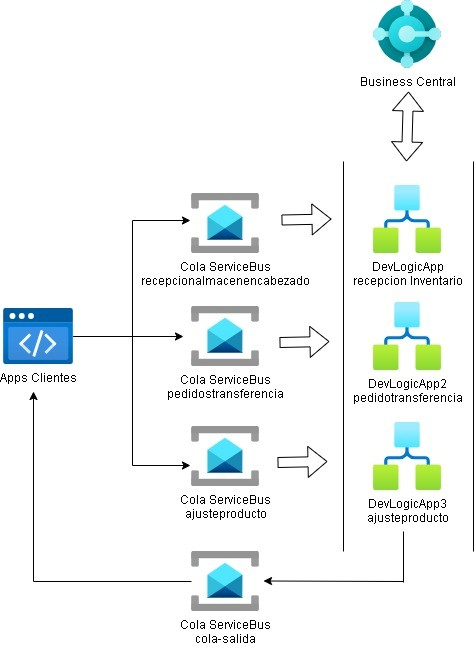
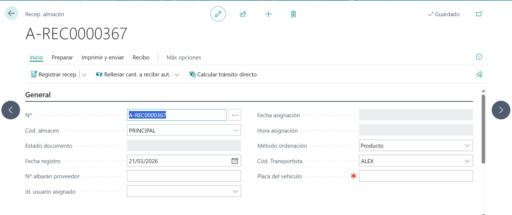
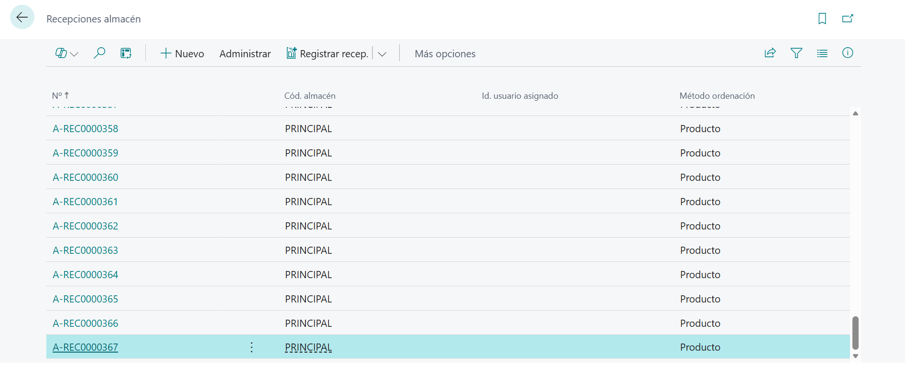
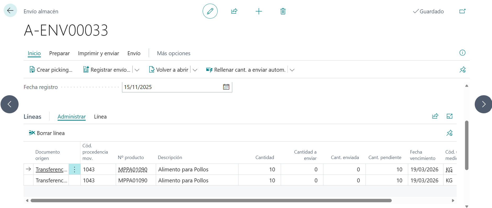
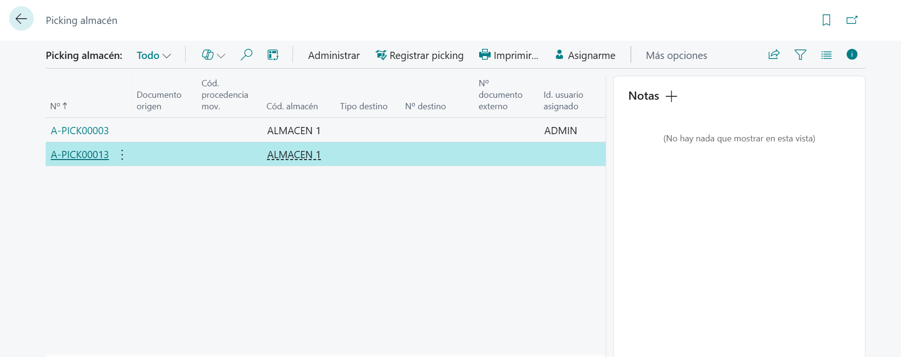
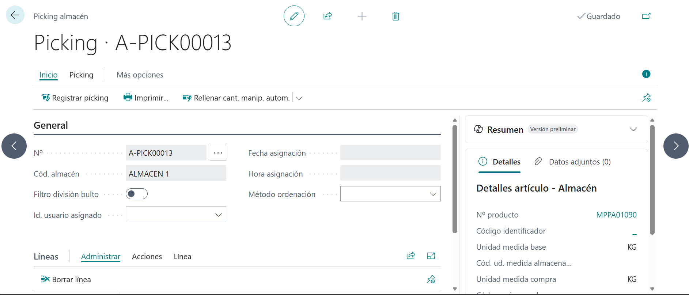
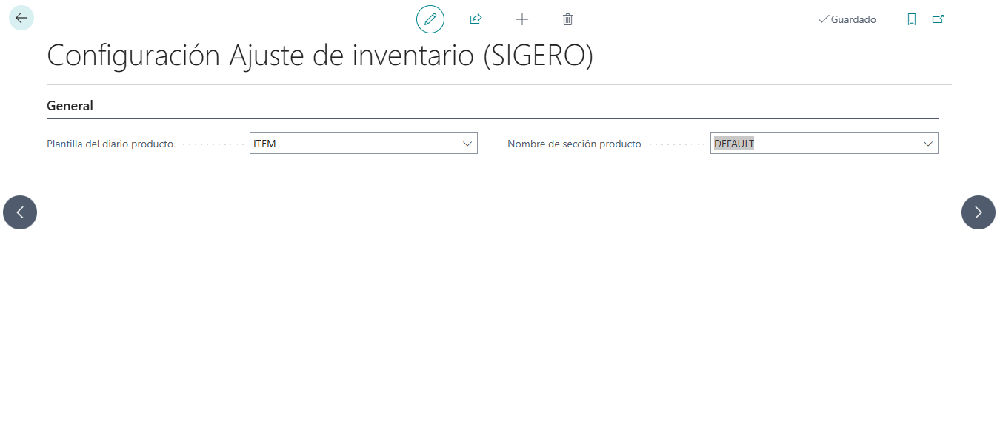
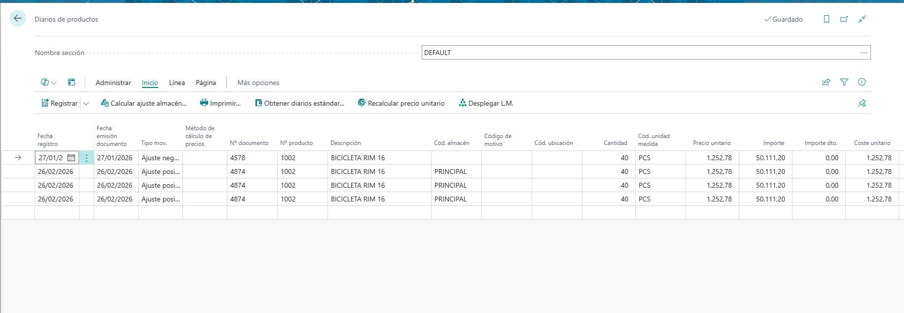

import { LinkCard } from '@astrojs/starlight/components';
import { Code } from '@astrojs/starlight/components';
import { Aside } from '@astrojs/starlight/components';

import examplePython from '../../../assets/sigero/js/send_receive_bus.py';

## Propuesta Técnica

### Flujos de Inserción vía Service Bus + Logic Apps

#### Lineamiento de Integración

**Garantía de Entrega Asíncrona**: Sigero depositará las transacciones en colas de mensajería independientes de la disponibilidad inmediata de Business Central. Esto asegura que la operación nunca se pierda por saturación del ERP 

**Confirmación de Recepción en Cola**: El servicio de mensajería emitirá un acuse de recibo inmediato cada vez que una inserción sea depositada correctamente en la cola. Esta notificación actúa como una garantía de persistencia, permitiendo que el sistema externo confirme el envío y libere la transacción.

**Identificación Única de Mensajes y Trazabilidad**: Cada mensaje depositado en la cola recibirá un identificador único global generado por la infraestructura de mensajería. Este ID servirá como la referencia de seguimiento compartida entre ambos sistemas, permitiendo realizar consultas posteriores sobre el estado de la integración (En espera, Procesado o Fallido).

**Gestión de Bloqueos y Resiliencia**: Ante bloqueos temporales de tablas en Business Central, la lógica de integración aplicará ciclos de reintento automático con tiempos de espera exponenciales. El proceso solo se dará por fallido tras agotar los intentos configurados, protegiendo la continuidad operativa.

**Aislamiento y Trazabilidad de Errores**: Aquellas transacciones que contengan errores lógicos o de datos serán desviadas a una cola de mensajes fallidos para su inspección. Esto permite que el resto del flujo continúe operando sin interrupciones.


#### Librerías y Recursos

##### Azure SDK

La interacción con el bus de servicio debe realizarse obligatoriamente a través del SDK oficial de Azure, descartando el uso de llamadas REST genéricas.

#### Flujo General del proceso

-	Se recibe una solicitud desde Service Bus.
-	Si la recepcion se procesa correctamente se envia una respuesta 201 al remitente.
-	En paralelo los datos recibidos son procesados por la logica del flujo en Logic App para derivarlo a Business Central. Cada proceso tiene definida una cola para evitar que los mensajes se solapen o un flujo elevando afecte una unica cola.



### Sincronización de Maestros vía Webhooks

Es un mecanismo que envía una notificación HTTP automática a una URL cada vez que ocurre un cambio (Crear, Modificar o Eliminar) en una tabla de Business Central. 
Business Central avisa proactivamente al ecosistema en el segundo exacto en que se crea o modifica un registro, eliminando la necesidad de consultas constantes (polling) que ralentizan el ERP.

Entidades a utilizar

- **Artículos.**
- **Unidades de Medida.**
- **Clientes.**
- **Proveedores.**
- **Almacenes.**
- **Transportistas.**
- **Códigos de motivo.**

#### Lineamiento de Integración

**Notificación de Eventos en Business Central**:  En el momento en que se produzca una creación o modificación en Business Central, el Webhook disparará una notificación hacia la Sigero.
**Vinculación de Identidades (ID Único)**: Todo registro guardado en Sigero (Clientes, Artículos, Proveedores, etc.) debe contener obligatoriamente el ID del registro original de Business Central (SystemId/GUID)
**Suscripción por Entidad**: Se configurará un Webhook independiente por cada entidad maestra (por compañía y ambiente).
**Renovación de suscripción**: El sistema debe enviar una petición a la API de suscripciones de Business Central para actualizar la fecha y hora de expiración de cada Webhook activo.
**Gestión de Seguridad**: Sigero debe validar el token o Client State incluido en el Webhook para confirmar que la petición proviene exclusivamente de nuestra instancia de Business Central.

### Consumo Manual vía API OData/REST

Complementando la arquitectura de eventos, habilitaremos el consumo manual de datos a través de las APIs estándar de Business Central (v2.0). El acceso está protegido mediante el protocolo de autorización moderno de Microsoft, garantizando que solo aplicaciones registradas en Azure AD puedan consumir los datos.

####  Lineamiento de Integración

**Herramientas de Consumo**: El acceso podrá realizarse mediante herramientas de prueba de APIs (como Postman), scripts de administración o desde la propia interfaz de consulta de Sigero, siempre bajo intervención humana.
**Autenticación Individual**: Cada consulta debe estar respaldada por un token de acceso seguro (OAuth 2.0), asegurando que solo personal autorizado pueda "leer" los datos del ERP.
**Restricción de Operaciones**: Por seguridad, el acceso manual vía API se configurará preferentemente en modo "Solo Lectura" (GET) para las entidades maestras. Cualquier inserción de datos deberá seguir el canal oficial del Service Bus para mantener la trazabilidad.


## Puntos Previos

### Configuración de credenciales de Business Central

Antes de poder utilizar las apis, Webhooks e integrar aplicaciones externas con Business Central, es fundamental contar con las credenciales de acceso necesarias.

#### Credenciales requeridas

1.	URL del ambiente de Business Central 
    -	URL de producción o ambiente de pruebas
    -	Ejemplo:https://api.businesscentral.dynamics.com/v2.0/[tenantId]/[environmentName]/company([companyId])
    -	**TenantId**: Identificador único del Proveedor.
    -	**enviromentName**: Nombre del ambiente a trabajar.
    -	**companyId**: Identificador de la compañía
2.	Credenciales OAuth 2.0 
    -	**Client ID (Aplicación ID)**: Identificador de la aplicación registrada
    -	**Client Secret**: Clave secreta de la aplicación.
3. Credenciales de Azure AD 
    -	Shared Access Signature (SAS) o certificado para autenticación segura.
3.	Permisos y alcances (Scopes) 
    -   Definir los permisos necesarios para acceder a las Apis
    -	Ejemplo: https://api.businesscentral.dynamics.com/.default
    -	Token de acceso (Oauth 2.0)

### Recursos para pruebas

Para facilitar la integración y pruebas de los Webhook de Business Central, está disponible un espacio de trabajo en Postman. Esto permite interactuar con la API sin necesidad de desarrollar código de cliente de manera inmediata.

<LinkCard
  title="Colección Business Central (Integración Romana)"
  href="https://documenter.getpostman.com/view/51769148/2sBXVkC9p7"
  target={'_blank'}
/>

<LinkCard
  title="Ejemplo Webhook Trigger (Azure Function)"
  href="https://github.com/Virtual-Office-Group/WebHookHttpTrigger/blob/master/HttpTriggerAzureFunction/Function1.cs"
  target={'_blank'}
/>

## Compañías de Business Central

Antes de trabajar con cualquier entidad en Business Central, es necesario conocer el `Company ID` de la compañía con la que se desea interactuar. Este es un paso fundamental ya que todas las operaciones posteriores requieren este identificador.

#### Consultar lista de Compañías (API Rest)

```json
GET 
https://api.businesscentral.dynamics.com/v2.0/{tenantId}/{environmentName}/api/v2.0/companies
Content-Type: application/json 
Authorization: Bearer {access_token}
```

#### Respuesta esperada

```json
{
  "@odata.context": "{{https://api.businesscentral.dynamics.com/v2.0/{tenantId}/{environmentName}/api/v2.0/$metadata#companies}}",
  "value": [
    {
      "id": "xxxxxxxx-xxxx-xxxx-xxxx-xxxxxxxxxxxx",
      "systemVersion": "25000",
      "timestamp": 45887,
      "name": "CRONUS",
      "displayName": "CRONUS International Ltd.",
      "businessProfileId": "",
      "systemCreatedAt": "2023-01-15T10:30:00Z",
      "systemCreatedBy": "a25fcdd5-5d7d-4986-b6da-2e09aa08c17f",
      "systemModifiedAt": "2024-06-20T14:45:00Z",
      "systemModifiedBy": "a25fcdd5-5d7d-4986-b6da-2e09aa08c17f",
    },
    {
      "id": "yyyyyyyy-yyyy-yyyy-yyyy-yyyyyyyyyyyy",
      "systemVersion": "25000",
      "timestamp": 45887,
      "name": "CRONUS",
      "displayName": "Mi Empresa S.A.",
      "businessProfileId": "",
      "systemCreatedAt": "2023-01-15T10:30:00Z",
      "systemCreatedBy": "a25fcdd5-5d7d-4986-b6da-2e09aa08c17f",
      "systemModifiedAt": "2024-06-20T14:45:00Z",
      "systemModifiedBy": "a25fcdd5-5d7d-4986-b6da-2e09aa08c17f",
    }
  ]
}
```

**Campos de la respuesta**

| Nombre |	Tipo de dato |	Descripción |
|--- | ---- | ---- |
| @odata.context |  |	La URL que define el esquema y el origen de los datos |
| id |	Guid | 	ID único de la compañia |
| systemVersion |	Integer |	Versión del sistema |
| timestamp |	Integer | 	segundos del sistema |
| name	| Text[30] |	Nombre interno de la compañía. |
| displayName |	Text[250] |	Nombre para mostrar de la compañía. |
| businessProfileId | Guid |	ID del perfil de negocio (si aplica). |
| systemCreatedAt | Datetime | Fecha de creación de la compañía en el sistema. |
| systemCreatedBy |	Guid |	ID del usuario cuando se creó |
| systemModifiedBy |	Guid |	ID del usuario cuando se modificó. |
| systemModifiedAt |	Datetime |	Fecha de última modificación. |


## Uso de la Api en Business Central

Para interactuar con una API de Business Central, normalmente sigues estos pasos:

•	**Configuración en Azure**: Debes registrar una aplicación en el portal de Azure para obtener un Client ID y un Secret.
•	Identificar el Endpoint: 
    -   La URL suele tener esta estructura: https://api.businesscentral.dynamics.com/v2.0/{tenant_id}/{environment}/api/v2.0/companies({id})/customers
    - Realizar la petición (Verbos HTTP)

      - **GET**: Para leer datos.
      - **POST**: Para crear registros nuevos.
      - **PATCH**: Para actualizar parcialmente un registro.
      -	**DELETE**: Para eliminar (con precaución).

### El límite de consultas

Business Central utiliza un sistema de cuotas basado en el tiempo. Si se exceden, la API devolverá un error **HTTP 429 (Too Many Requests)**.

|ConceptoLímite (SaaS) | Solicitudes Concurrentes |
| ------- | -----------|
| Máximo solicitudes simultaneas | 100 solicitudes simultáneas por entorno. |
| Solicitudes por Minuto | Máximo 6,000 por minuto.| 

### El límite  de registros por consulta

Business Central puede un máximo de **20,000** registros por petición. Si tu consulta supera ese número, Business Central cortará la respuesta.

### Error 429 (Too Many Requests)

Al realizar consultas directas vía API, el sistema emisor es el responsable único de gestionar la saturación del ERP. Para prevenir errores 429 (Too Many Requests), 
el cliente debe implementar una cola local de reintentos que respete el encabezado `Retry-After` de Business Central. Esta propiedad indica el tiempo recomendado que el cliente debe esperar antes de volver a intentar la solicitud.

<Aside type="note">
  La inserción de datos a traves de Service Bus no está sujeta a este límite de consultas, ya que mitigara la saturación mediante la gestión de colas y reintentos automáticos en caso de bloqueos temporales.
</Aside>

### Uso de $select

Por defecto, si llamas a un endpoint como `/customers`, Business central te devuelve todos los campos (nombre, dirección, saldo, correos, etc.). Si solo quieres el nombre y el saldo, añades el parámetro a la URL:

```json
.../api/v2.0/companies(id)/customers?$select=number,displayName,balance
```

deben escribirse exactamente como aparecen en la definición de la API. Usa comas para separar los campos, sin espacios.

### Uso del @odata.nextLink

es una propiedad de control que contiene una URL de continuación. Representa un curso de estado en el servidor que permite al cliente recuperar el siguiente subconjunto de resultados (página) de una consulta masiva. Se genera automáticamente cuando el volumen de datos excede el límite de registros por respuesta.

**Ejemplo de Petición**

```json
GET 
https://api.businesscentral.dynamics.com/v2.0/.../items?$select=number,displayName&$top=2
```

**Ejemplo de JSON de Respuesta**

```json
{
 "@odata.context":"https://api.businesscentral.dynamics.com/v2.0/.../$metadata#items(number,displayName)", 
"value": [
 {
       "@odata.etag": "W/\"JzQ0OzE2MTI5ODc1NDI2MzI0ODExOzAwOyc=\"", 
         "number": "1896-S",
         "displayName": "Escritorio ATHENS" 
}, 
{
        "@odata.etag": "W/\"JzQ0OzE5MDU2ODc1NDI2MzI0ODExOzAwOyc=\"",
        "number": "1900-S",
         "displayName": "Silla PARIS" 
}
 ],
 "@odata.nextLink": "https://api.businesscentral.dynamics.com/v2.0/.../items?$select=number,displayName&$skiptoken=X'08100000005349500000'" 
}
```

<Aside type="note">@odata.nextLink: Es la URL que debes llamar para obtener los siguientes 2 productos.</Aside>

### Uso de $top

Define el límite superior de registros que el servidor debe retornar en el cuerpo de la respuesta.

ejemplo: Obtener los primeros 5 registros de los articulos.

```json
/items?$top=5
```

Se utiliza para omitir un número específico de registros de una colección antes de devolver los resultados restantes. Es el complemento directo de $top y es fundamental para implementar la lógica de paginación

```json
  GET .../items?$top=10&$skip=0
  GET .../items?$top=10&$skip=10
```

### Uso de $orderby

Especifica los criterios de clasificación de los recursos de una colección. Si no se incluye, Business Central devuelve los datos basándose en la Clave Primaria (Primary Key) de la tabla por defecto.

```json
GET .../salesOrders?$orderby=orderDate desc, customerName asc
```

## Uso de Webhook con Business Central

Los Webhook son mecanismos de comunicación que permiten la integración en tiempo real entre Business Central y aplicaciones externas. 

<Aside type="caution">
    **Importante**: El id de las compañías debe ser guardado localmente en tu aplicación para utilizarlo en consultas posteriores. Esto evitará tener que consultar la lista de compañías en cada operación y mejorará el rendimiento de tu integración.
</Aside>

### Creación de suscripción

Para implementar Webhook con Business Central, es necesario seguir un proceso de configuración que incluye la creación del endpoint y la suscripción a eventos.
Pasos para la configuración:

    1.	Creación de la Suscripción mediante API

<Aside type="caution">
    El uso de Webhook está diseñado específicamente para recibir notificaciones automáticas en tiempo real cada vez que ocurra un cambio en Business Central, eliminando así la necesidad de realizar consultas periódicas (polling) que sobrecargan el sistema y consumen recursos de forma ineficiente.
</Aside>

```json
POST 
https://api.businesscentral.dynamics.com/v2.0/{tenantId}/{environmentName}/api/v2.0/subscriptions
Content-Type: application/json 
Authorization: Bearer {access_token} 
body: { 
  "notificationUrl": "https://tu-servidor.com/webhook/endpoint",
  "resource": "companies(companyid) /purchaseOrders",
  "clientState": "OptionalSecretToken123",
}
```

Parámetros de la suscripción:

- **notificationUrl**: URL de tu endpoint que recibirá las notificaciones.
- **resource**: Entidad a la que te suscribes. Ejemplo: 
            -	**companies(companyId)/purchaseOrders** - Órdenes de compra.
- **clientState**: Token secreto opcional para validar que las notificaciones vienen de BC.

<Aside type="caution">
    Para completar la suscripción, Business Central envía un POST a tu URL con un parámetro llamado validationToken que tu servidor debe capturar y devolver inmediatamente como texto plano con un código 200 OK para confirmar que el endpoint es válido y está activo.
</Aside>

<Aside type="caution">
   Business Central utiliza la combinación de la notificationUrl y el resource como una llave única en su base de datos de gestión de eventos. Si intentas registrar una suscripción con una URL que ya existe para ese mismo recurso (incluso si es para una empresa o un entorno diferente dentro del mismo tenant), el sistema devolverá un error.
</Aside>

**Respuesta esperada (JSON)**

```json
{
    "@odata.context": "https://api.businesscentral.dynamics.com/v2.0/30eb258d-51a4-4f58-9c88-bf72d4d3325a/TEST/api/v2.0/$metadata#subscriptions/$entity",
    "@odata.etag": "W/\"JzE5Ozg3OTQ1NDA5NjgxOTE4MzYyOTMxOzAwOyc=\"",
    "subscriptionId": "a10b670ba93149c98c89fa574762ab2b",
    "notificationUrl": "https://funcionesdesarrollovog-b7aaazc5dmgzctbx.canadacentral-01.azurewebsites.net/api/FunctionHttpTrigger?code=C2u",
    "resource": "api/v2.0/companies(9c2a3721-0c80-ef11-ac21-0022483842ea)/customers",
    "timestamp": 6465970,
    "userId": "79d10a1b-ea16-483b-964d-5d547971cf47",
    "lastModifiedDateTime": "2026-02-05T18:37:57Z",
    "clientState": "optionalValueOf2048",
    "expirationDateTime": "2026-02-08T18:37:57Z",
    "systemCreatedAt": "2026-02-05T18:38:01.4Z",
    "systemCreatedBy": "79d10a1b-ea16-483b-964d-5d547971cf47",
    "systemModifiedAt": "2026-02-05T18:38:01.4Z",
    "systemModifiedBy": "79d10a1b-ea16-483b-964d-5d547971cf47"
}
```

<Aside type="note">
  La propiedad clientState es un valor secreto definido por el cliente en el momento de la creación de la suscripción. Este valor se incluye en cada notificación enviada por Business Central al endpoint del cliente, lo que permite validar que las notificaciones provienen exclusivamente de nuestra instancia de Business Central.
</Aside>

**Campos de la respuesta**

| Nombre | Tipo de dato | Descripción |
| :--- | :--- | :--- |
| @odata.context | String (URL) | La URL que define el esquema y el origen de los datos. |
| @odata.etag | String | Identificador de versión del registro para el control de concurrencia optimista. |
| subscriptionId | GUID | Identificador único de la suscripción de Webhook creada. |
| notificationUrl | Text[250] | Dirección URL donde Business Central enviará las notificaciones. |
| resource | Text[250] | Ruta de la API que define el recurso monitoreado. |
| timestamp | bigint | Número interno de control de versiones de la base de datos SQL. |
| userId | GUID | Identificador único del usuario de Business Central que originó la suscripción. |
| lastModifiedDateTime | DateTime | Fecha y hora de la última modificación de los parámetros de suscripción. |
| clientState | Text[250] | Secreto compartido para validar la autenticidad de las notificaciones. |
| expirationDateTime | DateTime | Fecha y hora exacta en la que el Webhook dejará de estar activo. |
| systemCreatedAt | DateTime | Marca de tiempo exacta de la creación del registro en el sistema. |
| systemCreatedBy | GUID | Identificador del usuario o servicio que creó el registro. |
| systemModifiedAt | DateTime | Marca de tiempo de la última modificación registrada por el sistema. |
| systemModifiedBy | DateTime | Identificador del usuario o servicio que realizó la última modificación en el sistema. | 

### Renovación de suscripciones:

Las suscripciones expiran máximo en 3 días, por lo que debes renovarlas periódicamente. Para renovar, debes enviar una solicitud PATCH al endpoint de la suscripción específica. No es necesario esperar a que venza; puedes hacerlo de forma proactiva.

<Aside type="caution">
   Cuando envías la solicitud para renovar, Business Central te exige demostrar que conoces la versión actual del registro que quieres modificar. para eso se utiliza @odata.etag de la suscripción.
</Aside>

```json
PATCH 
https://api.businesscentral.dynamics.com/v2.0/{tenantId}/{environmentName}/api/v2.0/subscriptions({subscriptionId})
Content-Type: application/json 
If-Match: @odata.etag (o el ETag específico de la suscripción) 
Authorization: Bearer {access_token}
```

**Respuesta esperada (JSON)**

```json
{
    "@odata.context": "https://api.businesscentral.dynamics.com/v2.0/30eb258d-51a4-4f58-9c88-bf72d4d3325a/TEST/api/v2.0/$metadata#subscriptions/$entity",
    "@odata.etag": "W/\"JzE5Ozg3NjQ5MTcyMDMyMDAwODMwNjcxOzAwOyc=\"",
    "subscriptionId": "a10b670ba93149c98c89fa574762ab2b",
    "notificationUrl": "https://funcionesdesarrollovog-b7aaazc5dmgzctbx.canadacentral-01.azurewebsites.net/api/FunctionHttpTrigger?code=",
    "resource": "api/v2.0/companies(9c2a3721-0c80-ef11-ac21-0022483842ea)/customers",
    "timestamp": 6466168,
    "userId": "79d10a1b-ea16-483b-964d-5d547971cf47",
    "lastModifiedDateTime": "2026-02-05T19:09:46Z",
    "clientState": "optionalValueOf2048",
    "expirationDateTime": "2026-02-08T19:09:46Z",
    "systemCreatedAt": "2026-02-05T18:38:01.4Z",
    "systemCreatedBy": "79d10a1b-ea16-483b-964d-5d547971cf47",
    "systemModifiedAt": "2026-02-05T19:09:48.653Z",
    "systemModifiedBy": "79d10a1b-ea16-483b-964d-5d547971cf47"
}
```

**Campos de la respuesta**

| Nombre | Tipo de dato | Descripción |
| :--- | :--- | :--- |
| @odata.context | String (URL) | URL que define el esquema y el origen de los datos. |
| @odata.etag | String | Identificador de versión del registro para control de concurrencia optimista (usar en `If-Match`). |
| subscriptionId | GUID | Identificador único de la suscripción de Webhook. |
| notificationUrl | String (URL) | Dirección URL donde Business Central enviará las notificaciones. |
| resource | String | Ruta de la API que define el recurso monitoreado. |
| timestamp | BigInt / Integer | Valor interno de control de versiones de la base de datos. |
| userId | GUID | Identificador del usuario que creó o autorizó la suscripción. |
| lastModifiedDateTime | DateTime | Fecha y hora de la última modificación de la suscripción. |
| clientState | String | Secreto compartido definido por el cliente para validar notificaciones. |
| expirationDateTime | DateTime | Fecha y hora en la que la suscripción expirará. |
| systemCreatedAt | DateTime | Marca temporal de creación del registro en el sistema. |
| systemCreatedBy | GUID | Identificador del usuario o servicio que creó el registro. |
| systemModifiedAt | DateTime | Marca temporal de la última modificación técnica registrada. |
| systemModifiedBy | GUID | Identificador del usuario o servicio que realizó la última modificación. |

<Aside type="caution">
  Tras hacer la renovación con éxito, la respuesta de Business Central te devolverá un nuevo JSON con un nuevo **@odata.etag**. Debes guardar ese nuevo valor si planeas hacer otra actualización más adelante.
</Aside>

### Listar suscripciones activas

Para listar las suscripciones activas en el entorno de Business Central realiza una petición GET al recurso de `subscriptions`.

```
GET {{https://api.businesscentral.dynamics.com/v2.0/{tenantId}/{environmentName}/api/v2.0/subscriptions}} 
Authorization: Bearer {access_token}
```

**Respuesta esperada (JSON)**

```json
{
  "@odata.context": "https://api.businesscentral.dynamics.com/v2.0/30eb258d-51a4-4f58-9c88-bf72d4d3325a/TEST/api/v2.0/$metadata#subscriptions",
  "value": [
    {
      "@odata.etag": "W/\"JzE5Ozg3NjQ5MTcyMDMyMDAwODMwNjcxOzAwOyc=\"",
      "subscriptionId": "a10b670ba93149c98c89fa574762ab2b",
      "notificationUrl": "https://funcionesdesarrollovog-b7aaazc5dmgzctbx.canadacentral-01.azurewebsites.net/api/FunctionHttpTrigger?code=",
      "resource": "api/v2.0/companies(9c2a3721-0c80-ef11-ac21-0022483842ea)/customers",
      "timestamp": 6466168,
      "userId": "79d10a1b-ea16-483b-964d-5d547971cf47",
      "lastModifiedDateTime": "2026-02-05T19:09:46Z",
      "clientState": "optionalValueOf2048",
      "expirationDateTime": "2026-02-08T19:09:46Z",
      "systemCreatedAt": "2026-02-05T18:38:01.4Z",
      "systemCreatedBy": "79d10a1b-ea16-483b-964d-5d547971cf47",
      "systemModifiedAt": "2026-02-05T19:09:48.653Z",
      "systemModifiedBy": "79d10a1b-ea16-483b-964d-5d547971cf47"
    }
  ]
}
```

**Campos de la respuesta**

| Nombre | Tipo de dato | Descripción |
| :--- | :--- | :--- |
| @odata.context | String (URL) | Indica el origen de los metadatos y el esquema de la respuesta. |
| value | Array | Contenedor con las suscripciones encontradas. |
| @odata.etag | String | Sello de versión del registro; usar para `If-Match` en actualizaciones. |
| subscriptionId | GUID | Identificador único de la suscripción (usado para PATCH/DELETE). |
| notificationUrl | String (URL) | URL que recibirá las notificaciones de cambios. |
| resource | String | Entidad o ruta de la API que se está monitoreando. |
| timestamp | BigInt / Integer | Valor interno de control de versiones en la base de datos. |
| userId | GUID | ID del usuario que creó o autorizó la suscripción. |
| lastModifiedDateTime | DateTime | Fecha y hora de la última modificación de la suscripción. |
| clientState | String | Valor secreto definido por el cliente para validar notificaciones. |
| expirationDateTime | DateTime | Fecha y hora en la que la suscripción expirará. |
| systemCreatedAt | DateTime | Marca temporal de creación del registro en el sistema. |
| systemCreatedBy | GUID | Identificador del usuario o servicio que creó el registro. |
| systemModifiedAt | DateTime | Marca temporal de la última modificación técnica registrada. |
| systemModifiedBy | GUID | Identificador del usuario o servicio que realizó la última modificación. |

### Eliminar una suscripción

Para eliminar la suscripción que tienes activa, debes realizar una petición DELETE apuntando específicamente al subscriptionId que tienes en tu JSON.

```json
DELETE 
https://api.businesscentral.dynamics.com/v2.0/{tenantId}/{environmentName}/api/v2.0/subscriptions({subscriptionId})
Authorization: Bearer {access_token} 
Content-Type: application/json 
If-Match: @odata.etag (o el ETag específico de la suscripción)
```

Cuando lanzas el DELETE con éxito, la respuesta de Business Central no contiene texto, solo un código de estado:

    - Código HTTP: **204 No Content**
    - Significado: La operación se realizó correctamente y la suscripción ha sido borrada permanentemente. No hay cuerpo (body) en la respuesta porque el recurso ya no existe.

### Notificaciones y tipos de cambios

Cada notificación enviada al suscriptor (notificationUrl) puede contener múltiples notificaciones de diferentes suscripciones. Aquí tienes un ejemplo de carga útil de notificación:

```json
{
  "value": [
    {
      "subscriptionId": "webhookItemsId",
      "clientState": "someClientState",
      "expirationDateTime": "2018-10-29T07:52:31Z",
      "resource": "api/v2.0/companies(b18aed47-c385-49d2-b954-dbdf8ad71780)/items(26814998-936a-401c-81c1-0e848a64971d)",
      "changeType": "updated",
      "lastModifiedDateTime": "2018-10-26T12:54:20.467Z"
    },
    {
      "subscriptionId": "webhookCustomersId",
      "clientState": "someClientState",
      "expirationDateTime": "2018-10-29T12:50:30Z",
      "resource": "api/v2.0/companies(b18aed47-c385-49d2-b954-dbdf8ad71780)/customers(130bbd17-dbb9-4790-9b12-2b0e9c9d22c3)",
      "changeType": "created",
      "lastModifiedDateTime": "2018-10-26T12:54:26.057Z"
    },
    {
      "subscriptionId": "webhookCustomersId",
      "clientState": "someClientState",
      "expirationDateTime": "2018-10-29T12:50:30Z",
      "resource": "api/v2.0/companies(b18aed47-c385-49d2-b954-dbdf8ad71780)/customers(4b4f31f0-dc1c-4033-b2aa-ab03ca1d6ebc)",
      "changeType": "deleted",
      "lastModifiedDateTime": "2018-10-26T12:54:30.503Z"
    },    
    {
      "subscriptionId": "salesInvoice",
      "clientState": "someClientState",
      "expirationDateTime": "2018-10-20T10:55:01Z",
      "resource": "/api/v2.0/companies(7dbba574-5f69-4167-a43e-fb975045de15)/salesInvoices?$filter=lastDateTimeModified%20gt%202018-10-15T11:00:00Z",
      "changeType": "collection",
       "lastModifiedDateTime": "2018-10-26T12:54:30.503Z"
    }
  ]
}
```

El parámetro "changeType" indica el tipo de cambio:
- Created: Se creo un nuevo registro
- Updated: Se modifico el registro.
- Deleted: Se elimino el registro.
- Collection: Significa que Business Central envía una notificación de que se han creado o cambiado muchos registros. Se aplica un filtro al recurso, lo que permite al suscriptor solicitar a todas las entidades que cumplan con el filtro.


<Aside type="caution">
  Las notificaciones no se envían inmediatamente cuando el registro cambia. Al retrasar las notificaciones, Business Central puede asegurarse de que solo se envíe una notificación, aunque el registro haya cambiado varias veces en cuestión de segundos. Por defecto, el sistema espera 30 segundos tras el primer cambio en una entidad antes de enviar la notificación. Durante el retraso de 30 segundos, si se modifican más de 1.000 registros, se envía una única notificación.
</Aside>

## Uso de SDK para el Azure Service Bus

### Ejemplos de codigo

<LinkCard
  title="Azure Service Bus client library samples for JavaScript"
  href="https://learn.microsoft.com/en-us/samples/azure/azure-sdk-for-js/service-bus-javascript/"
  target={'_blank'}
/>

<LinkCard
  title="Azure Service Bus client library samples for TypeScript"
  href="https://learn.microsoft.com/en-us/samples/azure/azure-sdk-for-js/service-bus-typescript/"
  target={'_blank'}
/>


<LinkCard
  title="Azure Service Bus client library samples for Python"
  href="https://learn.microsoft.com/en-us/samples/azure/azure-sdk-for-python/servicebus-samples/"
  target={'_blank'}
/>

<LinkCard
  title="Azure Service Bus client library samples for .NET"
  href="https://learn.microsoft.com/en-us/samples/azure/azure-sdk-for-net/azuremessagingservicebus-samples/"
  target={'_blank'}
/>

### Generar SAS Token para autenticación

Para autenticarte con Azure Service Bus, puedes generar un token SAS (Shared Access Signature) utilizando el siguiente código de ejemplo en Python. Este token se utiliza para autorizar tus solicitudes al Service Bus.

```python

import hmac
import hashlib
import base64
import time
import urllib.parse
import requests

def get_auth_token(sb_uri, key_name, key):
    """Genera el token SAS para la cabecera Authorization"""
    # El URI debe estar codificado para el string de firma
    ttl = int(time.time()) + 3600  # Válido por 1 hora
    expiry = str(ttl)
    
    encoded_uri = urllib.parse.quote_plus(sb_uri)
    string_to_sign = encoded_uri + '\n' + expiry
    
    # Firma HMAC-SHA256
    key_bytes = key.encode('utf-8')
    string_to_sign_bytes = string_to_sign.encode('utf-8')
    signature = base64.b64encode(hmac.new(key_bytes, string_to_sign_bytes, hashlib.sha256).digest())
    
    # Construcción del token codificado
    auth_format = 'SharedAccessSignature sr={0}&sig={1}&se={2}&skn={3}'
    token = auth_format.format(
        encoded_uri, 
        urllib.parse.quote_plus(signature), 
        expiry, 
        key_name
    )
    return token

# --- CONFIGURACIÓN ---
NAMESPACE = ""      # Solo el nombre, sin .servicebus...
ENTITY_PATH = "TU-COLA-O-TOPIC" # Nombre de la cola o el topic
KEY_NAME = "RootManageSharedAccessKey" 
KEY_VALUE = "TU-PRIMARY-KEY-AQUI"

# Construcción de la URL de Azure REST API
resource_uri = f"https://{NAMESPACE}.servicebus.windows.net/{ENTITY_PATH}"
send_url = f"{resource_uri}/messages"

# 1. Generar el Token
sas_token = get_auth_token(resource_uri, KEY_NAME, KEY_VALUE)
```

### Generar correlationId para ID de mensaje

Se necesita un GUID para el correlationId del mensaje. Aquí tienes un ejemplo de cómo generar un ID:

#### Formas de generar un GUID:

```
Python
import uuid
correlationId = str(uuid.uuid4())
print(correlationId)
2728f6b3-4aaa-4fe7-80d7-4c19fa21c625
 
NodeJS:
const { v4: uuidv4 } = require('uuid');
correlationId=uuidv4()
console.log(correlationId)
aa463307-09a0-4cb2-8cac-db745719c612
 
PowerShell
$correlationId=[guid]::NewGuid().ToString()
Write-Output $correlationId
da41df95-679b-40fd-ba67-d5b8fc311aa6
```

<Aside type="note">
  El correlationId es un identificador único que se asigna a cada mensaje enviado al Azure Service Bus. Este ID es crucial para rastrear y correlacionar mensajes a lo largo de su ciclo de vida, especialmente en escenarios de integración y depuración. Asegúrate de generar un nuevo correlationId para cada mensaje que envíes, ya que esto facilitará el seguimiento y la resolución de problemas en tu sistema.
</Aside>


### Obtener mensajes de Salida

Una vez enviado el mensaje procedemos con monitorear la cola de salida para obtener la respuesta. Usamos POST porque vamos a sacar el menssaje de la cola.

El trigger de la logica que sondea la cola recepcionalmacen lo ajuste a 30 segundos

El timeout del request lo ajuste a 30 segundos, dando el tiempo necesario para obtener el mensaje.


<LinkCard
  title="Ejemplo envio y recepción de mensajes con Azure Service Bus en Python"
  href={examplePython}
  target={'_blank'}
  download={true}
/>

## Recepción de Almacenes

### Obtener lista de Recepciones de Almacén

**Suscripción del recurso por webhook**

```json
POST 
https://api.businesscentral.dynamics.com/v2.0/{{TenantID}}/{{enviromentName}}/api/virtualOfficeGroup/integration/v1.0/subscriptions
Content-Type: application/json
Authorization: Bearer {access_token}
{
  "notificationUrl": UrlNotificationId,
  "resource": "/virtualOfficeGroup/vog/v1.0/companies({{companyId}})/warehouseReceipts",
  "clientState": ""
}
```

<Aside type="caution">
La suscripción de recepciones se gestiona a través de una API personalizada. Para realizar la solicitud de suscripción, se debe utilizar la siguiente estructura de URL en el endpoint:

```text 
POST > https://api.businesscentral.dynamics.com/v2.0/{{TenantID}}/{{enviromentName}}/api/virtualOfficeGroup/integration/v1.0/subscriptions
```
</Aside>

**Consumir Endpoints (Manual)**

```json
GET
https://api.businesscentral.dynamics.com/v2.0/{{TenantID}}/DEMO/api/virtualOfficeGroup/integration/v1.0/companies(db22931c-25f2-f011-8405-000d3a88d306)/transferOrders?$expand=transferOrderLines
Content-Type: application/json
Authorization: Bearer {access_token}
```

### Creación de Recepciones de Almacenes

```json
POST
https://{namespace}.servicebus.windows.net/{queue_name}/messages
Header{
  Content-Type: application/json
  Authorization: Bearer {SharedAccessSignature}
  companyID: {companyID} // Id de la compañía en Business Central
  environment: {environment} // Nombre del ambiente en Business Central
  BrokerProperties: {CorrelationId:{correlationId}} // CorrelationId para rastreo del mensaje
}
body
{

  "locationCode": "PRINCIPAL", //Codigo de Almacen
  "postingDate": "2026-02-10", // Fecha de Registro
  "sortingMethod": "Item", // Metodo de Orden
  "shippingAgentCode": "ALEX", //Codigo del transportista
  "warehouseReceiptLines": [
    { 
      "sourceDocument": "Purchase Order", // Tipo de documento de origen
      "sourceNo": "C-PDA0000273", // Numero de documento de origen
      "sourceLineNo": 50000, // Numero de linea del documento de origen
      "itemNo": "PROD005", // Codigo del articulo
      "unitMeasureCode": "KG", // Unidad de medida
      "quantity": 10 // Cantidad a recibir
    },
    { 
      "sourceDocument": "Purchase Order", // Tipo de documento de origen
      "sourceNo": "C-PDA0000273", // Numero de documento de origen
      "sourceLineNo": 50000, // Numero de linea del documento de origen
      "itemNo": "PROD003", // Codigo del articulo
      "unitMeasureCode": "KG", // Unidad de medida
      "quantity": 10 // Cantidad a recibir
    }
  ]
}
```

**Datos obtenidos**

```json
{
    "@odata.context": "https://api.businesscentral.dynamics.com/v2.0/30eb258d-51a4-4f58-9c88-bf72d4d3325a/TEST/api/virtualOfficeGroup/integration/v1.0/$metadata#companies(41cc1c74-5021-f011-9af7-000d3ac04986)/warehouseReceipts/$entity",
    "@odata.etag": "W/\"JzE5OzE2MDIwNTUwMDg1MTM5NjkzODIxOzAwOyc=\"",
    "id": "418de961-8125-f111-bec2-7ced8da8a20f",
    "documentNo": "A-REC0000367",
    "locationCode": "PRINCIPAL",
    "noSeries": "A-RECEPCIÓN",
    "zoneCode": "",
    "binCode": "",
    "postingDate": "2026-03-21",
    "vendorShipmentNo": "",
    "shippingAgentCode": "ALEX",
    "plate": "",
    "sortingMethod": "Item",
    "assignedUserID": "",
    "systemModifiedAt": "2026-03-21T23:55:05.957Z",
    "warehouseReceiptLines": [
        {
            "@odata.etag": "W/\"JzIwOzE2OTU1NTk0NjkwNjgzMjQ5MTQ2MTswMDsn\"",
            "id": "428de961-8125-f111-bec2-7ced8da8a20f",
            "documentNo": "A-REC0000367",
            "locationCode": "",
            "lineNo": 1000,
            "itemNo": "PROD005",
            "description": "NITRATO DE SODIO",
            "quantity": 10.00000,
            "qtyReceive": 10.00000,
            "qtyOutstanding": 10.00000,
            "qtyReceived": 0,
            "unitMeasureCode": "KG",
            "sourceType": 39,
            "sourceSubtype": "1",
            "sourceNo": "C-PDA0000273",
            "sourceLineNo": 50000,
            "sourceDocument": "Purchase_x0020_Order",
            "status": " ",
            "systemModifiedAt": "2026-03-21T23:55:06.037Z",
            "sortingSequenceNo": 0
        },
        {
            "@odata.etag": "W/\"JzIwOzE1NzY3MzExOTA3OTA1MDA2NjI4MTswMDsn\"",
            "id": "438de961-8125-f111-bec2-7ced8da8a20f",
            "documentNo": "A-REC0000367",
            "locationCode": "",
            "lineNo": 2000,
            "itemNo": "PROD003",
            "description": "CARNE DE AVE",
            "quantity": 10.00000,
            "qtyReceive": 10.00000,
            "qtyOutstanding": 10.00000,
            "qtyReceived": 0,
            "unitMeasureCode": "KG",
            "sourceType": 39,
            "sourceSubtype": "1",
            "sourceNo": "C-PDA0000273",
            "sourceLineNo": 50000,
            "sourceDocument": "Purchase_x0020_Order",
            "status": " ",
            "systemModifiedAt": "2026-03-21T23:55:06.073Z",
            "sortingSequenceNo": 0
        }
    ]
}
```

**Campos de la respuesta (Encabezado)**

| Nombre | Tipo de dato | Descripción |
| :--- | :--- | :--- |
| @odata.context |  | La URL que define el esquema y el origen de los datos. |
| @odata.etag |  | Un identificador de versión del registro. |
| id | Guid | ID de la recepción de almacén creada. |
| documentNo | Text[20] | Número de documento de la recepción de almacén.
| locationCode | Text[20] | Código del almacén donde se está realizando la recepción. |
| noSeries | Text[20] | Serie de numeración utilizada para generar el número de documento. |
| zoneCode | Text[20] | Código de la zona dentro del almacén (si aplica). |
| binCode | Text[20] | Código de la ubicación específica dentro del almacén (si aplica). |
| postingDate | Date | Fecha de registro de la recepción. |
| vendorShipmentNo | Text[20] | Número de envío del proveedor (si aplica).
| shippingAgentCode | Text[20] | Código del agente de transporte asociado a la recepción. |
| plate | Text[20] | Número de placa del vehículo de transporte (si aplica).
| sortingMethod | Text[20] | Método de ordenamiento utilizado para las líneas de la recepción. |
| assignedUserID | Text[20] | ID del usuario asignado para gestionar la recepción (si aplica). |
| systemModifiedAt | Datetime | Fecha y hora de la última modificación del registro. |


**Campos de la respuesta (Líneas)**

| Nombre | Tipo de dato | Descripción |
| :--- | :--- | :--- |
| sourceDocument | Text[50] | Tipo de documento de origen relacionado con la línea de recepción (por ejemplo, "Purchase Order"). |
| sourceNo | Text[50] | Número del documento de origen que respalda la línea de recepción. |
| sourceLineNo | Integer | Número de línea específico dentro del documento de origen. | 
| itemNo | Text[50] | Código del artículo que se está recibiendo. |
| unitMeasureCode | Text[20] | Código de la unidad de medida utilizada para la cantidad recibida (por ejemplo, "KG"). |
| quantity | Decimal | Cantidad del artículo que se está recibiendo. |

Para poder visualizarlo, el usuario debe navegar a la pantalla de **Recepción Almacén.** Desde esta ventana, es posible visualizar y gestionar todos los documentos de entrada pendientes de recepción de almacén.

**Listado de recepciones de almacén**


** Detalle de la recepción de almacén**



## Pedidos de Transferencia

### Obtener lista de Pedidos de Transferencia

**Suscripción del recurso por webhook**

```json
POST 
https://api.businesscentral.dynamics.com/v2.0/{{TenantID}}/{{enviromentName}}/api/virtualOfficeGroup/integration/v1.0/subscriptions
Content-Type: application/json
Authorization: Bearer {access_token}
{
  "notificationUrl": UrlNotificationId,
  "resource": "/virtualOfficeGroup/vog/v1.0/companies({{companyId}})/transferOrders",
  "clientState": ""
}
```

<Aside type="caution">
La suscripción de transferencias se gestiona a través de una API personalizada. Para realizar la solicitud de suscripción, se debe utilizar la siguiente estructura de URL en el endpoint:

```text 
POST > https://api.businesscentral.dynamics.com/v2.0/{{TenantID}}/{{enviromentName}}/api/virtualOfficeGroup/integration/v1.0/subscriptions
```
</Aside>

### Creación de Pedidos de Transferencia

```json
POST
https://{namespace}.servicebus.windows.net/{queue_name}/messages
Header{
  Content-Type: application/json
  Authorization: Bearer {SharedAccessSignature}
  companyID: {companyID} // Id de la compañía en Business Central
  environment: {environment} // Nombre del ambiente en Business Central
}
body
{
    "transferFromCode": "ALMACEN 1", // Codigo del almacen origen
    "transferToCode": "ALMACEN 2", // Codigo del almacen destino
    "directTransfer": false, // Define si el movimiento es directo o en transito
    "transferOrderLines": [
        {   
            "itemNo": "MPPA01090", // Codigo del articulo
            "qty": 10, // Cantidad a transferir
            "outstandingQuantity": 10, // Cantidad pendiente por transferir
            "unitMeasureCode": "KG" // Unidad de medida
        },
        {
            "itemNo": "MPPA01090", // Codigo del articulo
            "qty": 10, // Cantidad a transferir
            "outstandingQuantity": 10, // Cantidad pendiente por transferir
            "unitMeasureCode": "KG" // Unidad de medida
        }
    ]
}
```

**Datos obtenidos**

```json
{
      "@odata.etag": "W/\"JzIwOzEyMTgyNTIwNDM2NzYxNTg2OTkzMTswMDsn\"",
      "No": "I-TRAN0000056",
      "id": "8db86854-4b08-f111-8405-000d3ac0ae45",
      "transferFromCode": "NUEVO",
      "transferFromName": "NUEVA LOCACIÓN",
      "transferFromName2": "",
      "transferFromAddress": "",
      "transferFromAddress2": "",
      "transferFromPostCode": "",
      "transferFromCity": "",
      "transferFromCounty": "",
      "transferFromContact": "",
      "trsfFromCountryRegionCode": "",
      "transferToCode": "SIMPLE",
      "transferToName": "ALMACEN SIMPLE",
      "transferToName2": "",
      "transferToAddress": "",
      "transferToAddress2": "",
      "transferToPostCode": "",
      "transferToCity": "",
      "transferToCounty": "",
      "transferToContact": "",
      "trsfToCountryRegionCode": "",
      "status": "Open",
      "comment": false,
      "directTransfer": false,
      "inTransitCode": "TRANSITO",
      "shipmentDate": "2026-02-12",
      "receiptDate": "2026-02-12",
      "postingDate": "2026-02-12",
      "shippingAgentCode": "",
      "plate": "",
      "systemCreatedAt": "2026-02-12T19:45:07.76Z",
      "systemModifiedAt": "2026-02-12T19:47:30.867Z",
      "transferOrderLines": [
        {
          "@odata.etag": "W/\"JzE5OzI5MDEzMzkwNDI5NjU0NjExNjcxOzAwOyc=\"",
          "documentNo": "I-TRAN0000056",
          "id": "73666881-4b08-f111-8405-000d3ac0ae45",
          "lineNo": 10000,
          "itemNo": "PROD001",
          "qty": 30,
          "description": "HARINA DE MAIZ ",
          "unitOfMeasure": "Kilo",
          "qtytoShip": 30,
          "qtytoReceive": 0,
          "qtyShipped": 0,
          "qtyReceived": 0,
          "status": "Open",
          "unitMeasureCode": "KG",
          "systemModifiedAt": "2026-02-12T19:47:30.85Z"
        }
      ]
    }
```

**Campos de la respuesta (Encabezado)**

| Nombre | Tipo de dato | Descripción |
| :--- | :--- | :--- |
| @odata.context |  | La URL que define el esquema y el origen de los datos |
| @odata.etag | String | Un identificador de versión del registro. |
| id | Guid | ID pedido de transferencia |
| No | Text[20] | Código pedido de transferencia |
| transferFromCode | Text[20] | El código de la ubicación de origen. |
| transferFromName | Text[100] | Nombre comercial o descripción de la ubicación de origen. |
| transferFromName2 | Text[50] | Campo de nombre secundario para el origen. |
| transferFromAddress | Text[100] | Dirección física del almacén de origen. |
| transferFromAddress2 | Text[50] | Dirección adicional del almacén de origen. |
| transferFromPostCode | Text[20] | Código postal de la ubicación de origen. |
| transferFromCity | Text[30] | Ciudad de la ubicación de origen. |
| transferFromCounty | Text[30] | Provincia, estado o condado de la ubicación de origen. |
| transferFromContact | Text[100] | Persona de contacto responsable. |
| trsfToCountryRegionCode | Text[10] | Código ISO del país/región de destino. |
| status | Text[30] | Indica el ciclo de vida del documento. |
| comment | Boolean | Indica si existen líneas de comentarios anexadas al encabezado. |
| directTransfer | Boolean | Define el flujo: false = requiere envío y recepción; true = movimiento instantáneo. |
| inTransitCode | Text[10] | Código del almacén virtual de tránsito. |
| shipmentDate | Datetime | Fecha prevista en la que se registra la salida. |
| receiptDate | Datetime | Fecha prevista en la que se registra la entrada. |
| postingDate | Datetime | Fecha de registro contable. |
| shippingAgentCode | Text[10] | Código del transportista. |
| plate | Text[10] | Campo de texto para la matrícula. |
| systemCreatedAt | Datetime | Marca de tiempo que indica el momento exacto de la creación del registro. |
| lastModifiedDateTime | Datetime | Marca de tiempo (UTC) de la última vez que se realizó un cambio en cualquier campo de este registro. |

**Campos de la respuesta (Líneas)**

| Nombre | Tipo de dato | Descripción |
| :--- | :--- | :--- |
| @odata.context |  | La URL que define el esquema y el origen de los datos |
| @odata.etag | | Un identificador de versión del registro. |
| id | Guid | ID de la línea. |
| lineNo | Integer | Es el identificador secuencial de la línea. |
| itemNo |  | El código o SKU del producto en tu inventario. |
| description | Text | El nombre comercial del producto. |
| qty | Decimal/Integer | La cantidad total que se planea transferir. |
| qtytoShip | Decimal/Integer | Cantidad pendiente por enviar. |
| qtytoReceive | Decimal/Integer | Cantidad pendiente por recibir. |
| qtyShipped | Decimal/Integer | Cantidad ya enviada. |
| qtyReceived | Decimal/Integer | Cantidad ya recibida. |
| status | Text | Estado de la línea (Open, Released, etc.). |
| unitOfMeasure | Text | Unidad de medida legible. |
| unitMeasureCode | Text | Código de la unidad de medida (ej. KG). |
| lastModifiedDateTime | Datetime | Marca de tiempo (UTC) de la última vez que se realizó un cambio en cualquier campo de este registro. |

### Creacion de Envios de Almacén

En Business Central, la creación de un Envío de Almacén a partir de un Pedido de Transferencia no es automática por el simple hecho de registrar, sino que depende estrictamente de la jerarquía de configuración en la ficha del almacén de origen.

```json
POST
https://{namespace}.servicebus.windows.net/{queue_name}/messages
Header{
  Content-Type: application/json
  Authorization: Bearer {SharedAccessSignature} 
  companyID: {companyID} // Id de la compañía en Business Central
  environment: {environment} // Nombre del ambiente en Business Central
  BrokerProperties: {CorrelationId:{correlationId}} // CorrelationId para rastreo del mensaje
}
body
{
  "environment":{environment}, // Nombre del entorno
  "companyName":{companyID}, //codigo de la compañia
  "transferOrderID": "8db86854-4b08-f111-8405-000d3ac0ae45", // ID del pedido de transferencia
}
```

**Datos Obtenidos**

```json
{
    "@odata.context": "https://api.businesscentral.dynamics.com/v2.0/30eb258d-51a4-4f58-9c88-bf72d4d3325a/DEMO/api/virtualOfficeGroup/integration/v1.0/$metadata#companies(db22931c-25f2-f011-8405-000d3a88d306)/warehouseShipments/$entity",
    "@odata.etag": "W/\"JzE5OzU3ODY5MDI5NDgxOTI4MDc4MDcxOzAwOyc=\"",
    "id": "6365b89b-171e-f111-8405-7ced8da8a20f",
    "locationCode": "ALMACEN 1",
    "no": "A-ENV00003",
    "sortingMethod": "None",
    "zoneCode": "",
    "documentStatus": "Partially_x0020_Shipped",
    "postingDate": "2025-11-09",
    "shippingAgentCode": "",
    "shipmentMethodCode": "",
    "status": "Released",
    "systemModifiedAt": "2026-03-12T13:35:39.263Z",
    "warehouseShipmentLines": [
        {
            "@odata.etag": "W/\"JzIwOzE2Njc2MTY5MDUwMzQyMDgyNzAyMTswMDsn\"",
            "id": "6465b89b-171e-f111-8405-7ced8da8a20f",
            "no": "A-ENV00003",
            "lineNo": 10000,
            "sourceType": 5741,
            "sourceSubtype": "0",
            "sourceDocument": "Outbound_x0020_Transfer",
            "sourceLineNo": 10000,
            "quantity": 100,
            "itemNo": "MPPA01090",
            "description": "Alimento para Pollos",
            "unitMeasureCode": "KG",
            "qtyperUnitMeasure": 1
        }
    ]
}
```
**campos de la respuesta (Encabezado)**

| Nombre | Tipo de dato | Descripción |
| :--- | :--- | :--- |
| @odata.context |  | La URL que define el esquema y el origen de los datos |
| @odata.etag | String | Un identificador de versión del registro. |
| id | Guid | ID del envío de almacén creado. |
| no | Text[20] | Número de documento del envío de almacén. |
| locationCode | Text[20] | Código del almacén desde el cual se realiza el envío. |
| sortingMethod | Text[20] | Método de ordenamiento utilizado para las líneas del envío. |
| zoneCode | Text[20] | Código de la zona dentro del almacén (si aplica). |
| documentStatus | Text[20] | Estado del documento (ej. "Partially Shipped"). |
| postingDate | Date | Fecha de registro del envío. |
| shippingAgentCode | Text[20] | Código del agente de transporte asociado al envío. |
| shipmentMethodCode | Text[20] | Código del método de envío utilizado. |
| status | Text[20] | Estado del envío (ej. "Released"). |
| systemModifiedAt | Datetime | Fecha y hora de la última modificación del registro. |


**Campos de la respuesta (Líneas)**

| Nombre | Tipo de dato | Descripción |
| :--- | :--- | :--- |
| @odata.etag | String | Un identificador de versión del registro. |
| id | Guid | ID de la línea del envío. |
| lineNo | Integer | Número de línea dentro del envío. |
| sourceType | Integer | Código que representa el tipo de documento de origen |
| sourceSubtype | Text[10] | Subtipo del documento de origen (si aplica). |
| sourceDocument | Text[50] | Tipo de documento de origen (ej. "Outbound Transfer"). |
| sourceLineNo | Integer | Número de línea del documento de origen que respalda esta línea del envío. |
| itemNo | Text[50] | Código del artículo que se está enviando. |
| description | Text[100] | Nombre comercial del artículo. |
| quantity | Decimal | Cantidad del artículo que se está enviando. |
| unitMeasureCode | Text[20] | Código de la unidad de medida utilizada para la cantidad enviada |
| qtyperUnitMeasure | Decimal | Cantidad de unidades por cada unidad de medida (si aplica). |

al momento de lanzar esta peticion creara automaticamente el envio del almacen del pedido de transferencia, siempre y cuando en la configuración del almacén de origen, se tenga seleccionado que el proceso de transferencias genere envíos de almacén.

Se podra visualizar el envío de almacén creado desde la pantalla de **Envios de Almacén** en Business Central, donde se podrán gestionar los envíos generados a partir de los pedidos de transferencia.





### Creacion Picking de Almacén

En business central, la creación de un Picking de Almacén a partir de un Envío de Almacén no es automática por el simple hecho de registrar, sino que depende estrictamente de la jerarquía de configuración en la ficha del almacén de origen.

El picking de almacen se crear a partir de cada linea del envio de almacen, por lo que para crear el picking de almacen se debe consumir el mismo endpoint que para la creación del envio de almacen, pero enviando en el body la información de la linea del pedido de transferencia y no del encabezado.

```json
POST
https://{namespace}.servicebus.windows.net/{queue_name}/messages
Header{
  Content-Type: application/json
  Authorization: Bearer {SharedAccessSignature}
  companyID: {companyID} // Id de la compañía en Business Central
  environment: {environment} // Nombre del ambiente en Business Central
  BrokerProperties: {CorrelationId:{correlationId}} // CorrelationId para rastreo del mensaje
}
{
  "environment":{environment}, // Nombre del entorno
  "companyName":{companyID}, //codigo de la compañia
  "warehouseShipmentLineID": "8db86854-4b08-f111-8405-000d3ac0ae45", // ID del linea del envio de almacen
}
```

**Datos Obtenidos**

```json
{
    "@odata.context": "https://api.businesscentral.dynamics.com/v2.0/30eb258d-51a4-4f58-9c88-bf72d4d3325a/DEMO/api/virtualOfficeGroup/integration/v1.0/$metadata#companies(db22931c-25f2-f011-8405-000d3ac04986)/warehousePickings/$entity",
    "@odata.etag": "W/\"JzE5OzU3ODY5MDI5NDgxOTI4MDc4MDcxOzAwOyc=\"",
    "id": "6365b89b-171e-f111-8405-7ced8da8a20f",
    "locationCode": "ALMACEN 1",
    "no": "A-PIC00003",
    "sortingMethod": "None",
    "sourceDocument": "Outbound_x0020_Transfer",
    "sourceno": "I-TRAN0000056",
    "postingDate": "2025-11-09",
    "shipmentDate": "2025-11-09",
    "systemModifiedAt": "2026-03-12T13:35:39.263Z",
    "warehouseActivityLines": [
        {
            "@odata.etag": "W/\"JzIwOzE2Njc2MTY5MDUwMzQyMDgyNzAyMTswMDsn\"",
            "id": "6465b89b-171e-f111-8405-7ced8da8a20f",
            "no": "A-PIC00003",
            "lineNo": 10000,
            "sourceType": 5741,
            "sourceSubtype": "0",
            "sourceDocument": "Outbound_x0020_Transfer",
            "sourceLineNo": 10000,
            "quantity": 100,
            "itemNo": "MPPA01090",
            "description": "Alimento para Pollos",
            "unitMeasureCode": "KG",
            "qtyperUnitMeasure": 1
        }
    ]
}
```

**Campos de la respuesta (Encabezado)**

| Nombre | Tipo de dato | Descripción |
| :--- | :--- | :--- |
| @odata.context |  | La URL que define el esquema y el origen de los datos |
| @odata.etag | String | Un identificador de versión del registro. |
| id | Guid | ID del picking de almacén creado. |
| no | Text[20] | Número de documento del picking de almacén. |
| locationCode | Text[20] | Código del almacén desde el cual se realiza el picking. |
| sortingMethod | Text[20] | Método de ordenamiento utilizado para las líneas del picking. |
| sourceDocument | Text[50] | Tipo de documento de origen (ej. "Outbound Transfer"). |
| sourceno | Text[20] | Número del documento de origen que respalda este picking. |
| postingDate | Date | Fecha de registro del picking. |
| shipmentDate | Date | Fecha de envío asociada al picking. |
| systemModifiedAt | Datetime | Fecha y hora de la última modificación del registro. |


**Campos de la respuesta (Líneas)**

| Nombre | Tipo de dato | Descripción |
| :--- | :--- | :--- |
| @odata.etag | String | Un identificador de versión del registro. |
| id | Guid | ID de la línea del picking. |
| lineNo | Integer | Número de línea dentro del picking. |
| sourceType | Integer | Código que representa el tipo de documento de origen |
| sourceSubtype | Integer | Subtipo del documento de origen (si aplica). |
| sourceDocument | Text[20] | Tipo de documento de origen. |
| sourceLineNo | Integer | Número de línea del documento de origen que respalda esta línea del picking. |
| itemNo | Text[20] | Código del artículo que se está preparando para envío. |
| description | Text[100] | Nombre comercial del artículo. |
| quantity | Decimal | Cantidad del artículo que se está preparando para envío. |
| unitMeasureCode | Text[20] | Código de la unidad de medida utilizada para la cantidad del picking. |
| qtyperUnitMeasure | Decimal | Cantidad de unidades por cada unidad de medida. |

al momento de lanzar esta peticion creara automaticamente el picking del almacen del envio de transferencia, siempre y cuando en la configuración del almacén de origen, se tenga seleccionado que el proceso de transferencias genere envíos de almacén.

Se podra visualizar el picking de almacén creado desde la pantalla de **Pickings de Almacén** en Business Central, donde se podrán gestionar los pickings generados a partir de los envíos de transferencia.





## Ajuste de Inventario

### Configuración de Ajuste de inventario

Para la creacion de ajuste de inventario a partir de la API, 
se debe configurar la plantilla y sección de diario a utilizar para crear los asientos en el
 diario de productos.Se pueden como **Configuración Ajuste de inventario (SIGERO)** en business central.



<Aside type="note">
  Este proceso está intrínsecamente vinculado a la Configuración de Plantilla de Diario General de Business Central.
</Aside>


### Ajuste positivo

```json
POST
https://{namespace}.servicebus.windows.net/{queue_name}/messages
Header{
  Content-Type: application/json
  Authorization: Bearer {sas_token}
  companyID: {companyID} // Id de la compañía en Business Central
  environment: {environment} // Nombre del ambiente en Business Central
  BrokerProperties: {CorrelationId:{correlationId}} // CorrelationId para rastreo del mensaje
}
{
    "environment":{environment}, // Nombre del entorno
    "companyName":{companyID}, //codigo de la compañia 
    "itemNo": "1002", // Codigo del Producto
    "entryType": "Positive Adjmt.", // Tipo de ajuste: Positivo
    "documentNo": "4874", //Numero de documento
    "locationCode": "PRINCIPAL", //Codigo el Almacen
    "quantity": 40 //Cantidad a ajustar
}
```

### Ajuste Negativo

```json
POST
https://{namespace}.servicebus.windows.net/{queue_name}/messages
Header{
  Content-Type: application/json
  Authorization: Bearer {SharedAccessSignature}
  companyID: {companyID} // Id de la compañía en Business Central
  environment: {environment} // Nombre del ambiente en Business Central
  BrokerProperties: {CorrelationId:{correlationId}} // CorrelationId para rastreo del mensaje
}
{
    "environment":{environment}, // Nombre del entorno
    "companyName":{companyID}, //codigo de la compañia
    "itemNo": "1002", // Codigo del Producto
    "entryType": "Negative Adjmt.", //Tipo de ajuste: Negativo
    "documentNo": "4874", //Numero de documento a vincular con el ajuste
    "locationCode": "PRINCIPAL", //Codigo el Almacen
    "quantity": 40 //Cantidad a ajustar
}
```

**Datos obtenidos**

```json
{
  "@odata.etag": "W/\"JzE5OzUyNzU3Nzg0NzIwNzgxMTYwNjkxOzAwOyc=\"",
  "journalId": "af6ea8d5-2c08-f111-8405-002248d31bd2",
  "journalTemplateName": "PRODUCTO",
  "journalBatchName": "GENERICO",
  "lineNo": 20000,
  "itemNo": "PROD001",
  "description": "HARINA DE MAIZ ",
  "entryType": "Positive Adjmt.",
  "sourceNo": "",
  "documentNo": "4874",
  "locationCode": "PRINCIPAL",
  "quantity": 40,
  "invoicedQuantity": 40,
  "unitAmount": 55222.331,
  "unitCost": 55222.331,
  "amount": 2208893.24,
  "discountAmount": 0,
  "systemModifiedAt": "2026-02-12T16:06:52.377Z"
}
```

**Campos de la respuesta**

| Nombre | Tipo de dato | Descripción |
| :--- | :--- | :--- |
| @odata.context |  | La URL que define el esquema y el origen de los datos |
| @odata.etag | String | Un identificador de versión del registro. |
| journalId | Guid | El ID de la cabecera del diario. |
| journalTemplateName | Text[10] | Nombre de la Plantilla del Diario. Define la estructura y el comportamiento del diario. |
| journalBatchName | Text[10] | Nombre del Sección. |
| lineNo | Integer | El número de línea. |
| itemNo | Text[20] | El código del producto. |
| description | Text[100] | Texto descriptivo de la línea. |
| entryType | Text[30] | Define la naturaleza del movimiento. |
| documentNo | Text[30] | El número de documento externo. |
| locationCode | Text[10] | Código del Almacén. |
| quantity | Decimal | Cantidad física que entrará o saldrá del inventario. |
| invoicedQuantity | Decimal | Cantidad que será procesada financieramente. |
| unitAmount | Decimal | Precio unitario del producto en la línea. |
| unitCost | Decimal | Costo unitario que se utilizará para valorar el inventario. |
| amount | Decimal | El valor total de la línea. |
| discountAmount | Decimal | Valor monetario del descuento aplicado a la línea. |
| systemModifiedAt | Datetime | Marca de tiempo (UTC) de la última vez que se realizó un cambio en cualquier campo de este registro. |

### Asientos de diario en Business Central

Los asientos de diario se pueden visualizar en la venta de **diario de productos**.

**Listado de asientos de diario**



<Aside type="note">
 La revisión y registros de los asientos de diario seran realizados por el usuario de Business Central.
</Aside>

## Consumo Pedidos de Compra

### Obtener lista de Pedidos de Compra

**Suscripción de webhook**

El consumo de pedidos de compra puede integrarse mediante webhook para detectar cambios sobre el recurso en Business Central.

```json
POST https://api.businesscentral.dynamics.com/v2.0/{{TenantID}}/{{enviromentName}}/api/v2.0/subscriptions
Content-Type: application/json
Authorization: Bearer {access_token}

{
  "notificationUrl": "%UrlNotificationId%",
  "resource": "api/v2.0/companies({{companyId}})/purchaseOrders",
  "clientState": ""
}
```

**Consumir Endpoints**

Para consultar manualmente las órdenes de compra, puedes consumir el endpoint estándar de Business Central.

```json
GET 
https://api.businesscentral.dynamics.com/v2.0/{{TenantID}}/{{enviromentName}}/api/v2.0/companies({{companyId}})/purchaseOrders?$expand=PurchaseOrderLines&$filter=status eq 'open' and fullyReceived  eq false
Content-Type: application/json
Authorization: Bearer {access_token}
```

**Datos obtenidos**

```json
{
  "@odata.etag": "W/\"JzIwOzE0OTk0MjAxMzgwMTQ2OTIxNzU4MTswMDsn\"",
  "id": "f454e208-1222-f011-9af7-6045bd3b911d",
  "number": "C-PDA0000262",
  "orderDate": "2025-04-25",
  "postingDate": "2025-04-25",
  "vendorId": "3efbdd7d-da21-f011-9af7-000d3ac04986",
  "vendorNumber": "C-PROV0000013",
  "vendorName": "PROVEEDOR 4",
  "payToName": "PROVEEDOR 4",
  "payToVendorId": "3efbdd7d-da21-f011-9af7-000d3ac04986",
  "payToVendorNumber": "C-PROV0000013",
  "shipToName": "ALMACEN PRINCIPAL",
  "shipToContact": "",
  "buyFromAddressLine1": "",
  "buyFromAddressLine2": "",
  "buyFromCity": "",
  "buyFromCountry": "",
  "buyFromState": "",
  "buyFromPostCode": "",
  "payToAddressLine1": "",
  "payToAddressLine2": "",
  "payToCity": "",
  "payToCountry": "",
  "payToState": "",
  "payToPostCode": "",
  "shipToAddressLine1": "",
  "shipToAddressLine2": "",
  "shipToCity": "",
  "shipToCountry": "",
  "shipToState": "",
  "shipToPostCode": "",
  "shortcutDimension1Code": "",
  "shortcutDimension2Code": "",
  "currencyId": "7d2ee4e9-5021-f011-9af7-002248dfda48",
  "currencyCode": "USD",
  "pricesIncludeTax": false,
  "paymentTermsId": "6f2ee4e9-5021-f011-9af7-002248dfda48",
  "shipmentMethodId": "00000000-0000-0000-0000-000000000000",
  "purchaser": "",
  "requestedReceiptDate": "0001-01-01",
  "discountAmount": 0,
  "discountAppliedBeforeTax": true,
  "totalAmountExcludingTax": 300,
  "totalTaxAmount": 48,
  "totalAmountIncludingTax": 348,
  "fullyReceived": false,
  "status": "Open",
  "lastModifiedDateTime": "2025-04-25T20:17:52.347Z",
  "purchaseOrderLines": [
    {
        "@odata.etag": "W/\"JzE5OzcwMjk4MTM5NjI2MDU1MzExNjYxOzAwOyc=\"",
        "id": "400ba948-1222-f011-9af7-6045bd3b911d",
        "documentId": "f454e208-1222-f011-9af7-6045bd3b911d",
        "sequence": 10000,
        "itemId": "5be2c78d-0f22-f011-9af7-6045bd3b911d",
        "accountId": "00000000-0000-0000-0000-000000000000",
        "lineType": "Item",
        "lineObjectNumber": "PROD007",
        "description": "SULFATO DE SODIO",
        "description2": "",
        "unitOfMeasureId": "4fcfdbef-5021-f011-9af7-002248dfda48",
        "unitOfMeasureCode": "KG",
        "quantity": 300,
        "directUnitCost": 1,
        "discountAmount": 0,
        "discountPercent": 0,
        "discountAppliedBeforeTax": false,
        "amountExcludingTax": 300,
        "taxCode": "IVA 16",
        "taxPercent": 16,
        "totalTaxAmount": 48,
        "amountIncludingTax": 348,
        "invoiceDiscountAllocation": 0,
        "netAmount": 300,
        "netTaxAmount": 48,
        "netAmountIncludingTax": 348,
        "expectedReceiptDate": "2025-04-25",
        "receivedQuantity": 295,
        "invoicedQuantity": 0,
        "invoiceQuantity": 295,
        "receiveQuantity": 0,
        "itemVariantId": "00000000-0000-0000-0000-000000000000",
        "locationId": "79231df8-d921-f011-9af7-000d3ac04986"
    }
  ]
},
```

**Campos de la respuesta (Encabezado)**

| Nombre | Tipo | Descripción |
| :--- | :--- | :--- |
| @odata.etag |  | Identificador de versión para control de concurrencia. |
| id | GUID | Identificador único universal del registro. |
| number | Text[20] | Códigoo pedido de compra |
| orderDate | Date | Fecha de emisión del documento. |
| postingDate | Date | Fecha contable del registro. |
| vendorId | GUID | ID único del proveedor vinculado. |
| vendorNumber | Text[20] | Código maestro del proveedor |
| vendorName | Text[100] | Nombre o razón social del proveedor. |
| payToName | Text[100] | Nombre de la entidad a la que se paga. |
| payToVendorId | GUID | ID del proveedor receptor del pago. |
| payToVendorNumber | Text[20] | Código del proveedor receptor del pago. |
| shipToName | Text[100] | Nombre del destino de entrega. |
| shipToContact | Text[100] | Persona de contacto en el punto de entrega. |
| buyFromAddressLine1 | Text[100] | Dirección principal de compra. |
| buyFromAddressLine2 | Text[50] | Dirección secundaria de compra. |
| buyFromCity | Text[50] | Ciudad del proveedor. |
| buyFromCountry | Text[10] | País del proveedor. |
| buyFromState | Text[40] | Estado o provincia del proveedor. |
| buyFromPostCode | Text[20] | Código postal del proveedor. |
| payToAddressLine1 | Text[100] | Dirección de facturación (Línea 1). |
| payToAddressLine2 | Text[50] | Dirección de facturación (Línea 2). |
| payToCity | Text[50] | Ciudad de facturación. |
| payToCountry | Text[20] | País de facturación. |
| payToState | Text[40] | Estado de facturación. |
| shipToAddressLine1 | Text[100] | Dirección de envío (Línea 1). |
| shipToAddressLine2 | Text[50] | Dirección de envío (Línea 2). |
| shipToCity | Text[30] | Ciudad de envío. |
| shipToCountry | Text[20] | País de envío. |
| shipToState | Text[40] | Estado de envío. |
| shipToPostCode | Text[20] | Código postal de envío. |
| shortcutDimension1Code | Text[20] | Código de dimensión contable 1. |
| shortcutDimension2Code | Text[20] | Código de dimensión contable 2. |
| currencyId | GUID | Identificador único de la divisa. |
| currencyCode | Text[10] | Código ISO de la moneda. |
| pricesIncludeTax | Boolean | Indica si los precios incluyen impuestos. |
| paymentTermsId | GUID | ID de los términos de pago configurados. |
| shipmentMethodId | GUID | ID del método de envío. |
| purchaser | Text[20] | Código del agente de compras. |
| requestedReceiptDate | Date | Fecha de recepción solicitada por el cliente. |
| discountAmount | Decimal | Monto total de descuento aplicado. |
| discountAppliedBeforeTax | Boolean | Define si el descuento afecta la base imponible. |
| totalAmountExcludingTax | Decimal | Subtotal antes de impuestos. |
| totalTaxAmount | Decimal | Monto de impuestos calculados. |
| totalAmountIncludingTax | Decimal | Total bruto de la transacción. |
| fullyReceived | Boolean | Indica si se recibió el 100% de la mercancía. |
| status | String | Estado del flujo del documento. |
| lastModifiedDateTime | DateTime | Sello de tiempo de la última edición. |

**Campos de la respuesta (Detalle)**

| Nombre | Tipo | Descripción |
| :--- | :--- | :--- |
| @odata.etag | String | Identificador de versión para control de concurrencia. |
| id | GUID | Identificador único de la línea de documento. |
| documentId | GUID | ID del documento principal (cabecera) al que pertenece. |
| sequence | Integer | Orden de aparición de la línea en el documento (10000). |
| itemId | GUID | Identificador único del producto en el sistema. |
| accountId | GUID | ID de la cuenta contable asociada (si aplica). |
| lineType | String | Tipo de línea (ej. Item/Producto). |
| lineObjectNumber | String | Código de referencia del producto (PROD007). |
| description | String | Descripción del producto (SULFATO DE SODIO). |
| description2 | String | Información adicional o secundaria del producto. |
| unitOfMeasureId | GUID | ID de la unidad de medida utilizada. |
| unitOfMeasureCode | String | Código de la unidad de medida (KG). |
| quantity | Decimal | Cantidad total solicitada (300). |
| directUnitCost | Decimal | Costo unitario directo del producto. |
| discountAmount | Decimal | Valor monetario del descuento en la línea. |
| discountPercent | Decimal | Porcentaje de descuento aplicado. |
| discountAppliedBeforeTax | Boolean | Indica si el descuento se aplicó antes de impuestos. |
| amountExcludingTax | Decimal | Importe neto antes de impuestos (300). |
| taxCode | String | Código del grupo de impuestos (IVA 16). |
| taxPercent | Decimal | Porcentaje de impuesto aplicado (16). |
| totalTaxAmount | Decimal | Importe total de impuestos de la línea (48). |
| amountIncludingTax | Decimal | Importe total con impuestos incluidos (348). |
| invoiceDiscountAllocation | Decimal | Parte proporcional del descuento de factura asignado. |
| netAmount | Decimal | Importe neto después de descuentos. |
| netTaxAmount | Decimal | Importe de impuesto neto aplicado. |
| netAmountIncludingTax | Decimal | Total neto final con impuestos. |
| expectedReceiptDate | Date | Fecha estimada de recepción de la mercancía. |
| receivedQuantity | Decimal | Cantidad física ya recibida (295). |
| invoicedQuantity | Decimal | Cantidad que ya ha sido facturada. |
| invoiceQuantity | Decimal | Cantidad pendiente o lista para facturar (295). |
| receiveQuantity | Decimal | Cantidad pendiente por recibir físicamente. |
| itemVariantId | GUID | ID de la variante del producto (si aplica). |
| locationId | GUID | ID del almacén o ubicación de destino. |

## Consumo de Maestros de Datos

### Maestro de Artículos

El maestro de artículos contiene toda la información relacionada con los productos que maneja la empresa.

**Suscripción del recurso por webhook**

```json
POST
https://api.businesscentral.dynamics.com/v2.0/{tenantId}/{environmentName}/api/v2.0/subscriptions
Content-Type: application/json
Authorization: Bearer {access_token}
body
{
  "notificationUrl": "%UrlNotificationId%",
  "resource": "/api/v2.0/companies({{companyId}})/Items",
  "clientState": ""
}
```

**Endpoint para Listado de Articulos (Sincronización Manual)**

```json
GET
https://api.businesscentral.dynamics.com/v2.0/{{TenantID}}/{{enviromentName}}/api/v2.0/companies({{companyId}})/items
Content-Type: application/json 
Authorization: Bearer {access_token}
```

**Datos obtenidos**

```json
{
    "@odata.context": "https://api.businesscentral.dynamics.com/v2.0/30eb258d-51a4-4f58-9c88-bf72d4d3325a/TEST/api/v2.0/$metadata#companies(41cc1c74-5021-f011-9af7-000d3ac04986)/items",
    "value": [
        {
            "@odata.etag": "W/\"JzE5OzE3Mzg5MzEwMDE1NjQyNjE0OTExOzAwOyc=\"",
            "id": "1ea0551c-7378-f011-8eef-002248de9fb5",
            "number": "ALQUILER",
            "displayName": "Alquiler de inmueble",
            "displayName2": "",
            "type": "Service",
            "itemCategoryId": "00000000-0000-0000-0000-000000000000",
            "itemCategoryCode": "",
            "blocked": false,
            "gtin": "",
            "inventory": 0,
            "unitPrice": 0,
            "priceIncludesTax": false,
            "unitCost": 0,
            "taxGroupId": "00000000-0000-0000-0000-000000000000",
            "taxGroupCode": "",
            "baseUnitOfMeasureId": "5bcfdbef-5021-f011-9af7-002248dfda48",
            "baseUnitOfMeasureCode": "UND",
            "generalProductPostingGroupId": "6dcfdbef-5021-f011-9af7-002248dfda48",
            "generalProductPostingGroupCode": "SERVICIOS",
            "inventoryPostingGroupId": "00000000-0000-0000-0000-000000000000",
            "inventoryPostingGroupCode": "",
            "lastModifiedDateTime": "2025-08-13T18:28:16.41Z"
        }
 ]}
```

**Campos de la respuesta**

| Nombre | Tipo de dato | Descripción |
| :--- | :--- | :--- |
| **@odata.context** | String (URL) | La URL que define el esquema y el origen de los datos. |
| @odata.etag | String | Un identificador de versión del registro (concurrencia). |
| id | Guid | El GUID (Identificador Único Global) interno de Business Central. |
| number | Text[20] | Es el código de producto (No. de artículo). |
| displayName | Text[100] | El nombre principal del artículo que aparecerá en los documentos. |
| displayName2 | Text[50] | Descripción secundaria o extendida para nombres en otros idiomas o detalles técnicos. |
| type | Enum/Text[20] | Define el tipo de productos (Inventory, Service o Non-Inventory). |
| itemCategoryId | Guid | ID de la categoría del producto. |
| itemCategoryCode | text[20] | Código de la categoría asignada. |
| blocked | Boolean | Si es true, el ítem está deshabilitado para transacciones. |
| gtin | Text[14] | Código de barras estándar internacional. |
| inventory | Decimal | Cantidad física actual en existencias. |
| unitPrice | Decimal | Precio de venta unitario antes de impuestos. |
| priceIncludesTax | Boolean | Indica si el valor en unitPrice ya contiene el impuesto (IVA/VAT). |
| unitCost | Decimal | Costo unitario del producto. |
| taxGroupId | Guid | ID del grupo de impuestos. |
| taxGroupCode | Text[20] | Código que vincula el producto con una configuración de impuestos específica. |
| baseUnitOfMeasureId | Guid | ID de la unidad de medida base. |
| baseUnitOfMeasureCode | Text[10] | Código de la unidad de medida (ej. PZ, UND, KG). |
| generalProductPostingGroupId | Guid | ID del grupo de registro de producto (General). |
| generalProductPostingGroupCode | Text[20] | Determina las cuentas de ingresos y gastos en el Libro Mayor. |
| inventoryPostingGroupId | Guid | ID del grupo de registro de inventario. |
| inventoryPostingGroupCode | Text[20] | Determina la cuenta de activos (Inventario) en el balance. |
| lastModifiedDateTime | Datetime | Marca de tiempo (UTC) de la última modificación del registro. |


### Maestro de Clientes

El maestro de clientes contiene toda la información relacionada con los clientes registrados en la empresa.

**Suscripción del recurso por webhook**

```json
POST 
https://api.businesscentral.dynamics.com/v2.0/{tenantId}/{environmentName}/api/v2.0/subscriptions
Content-Type: application/json
Authorization: Bearer {access_token}
body
{
  "notificationUrl": "UrlNotificationId",
  "resource": "/api/v2.0/companies({{companyId}})/customers",
  "clientState": ""
}
```

**Endpoint para Listado de clientes (Sincronización Manual)**

```json
GET
https://api.businesscentral.dynamics.com/v2.0/{{TenantID}}/{{enviromentName}}/api/v2.0/companies({{companyId}})/customers
Content-Type: application/json 
Authorization: Bearer {access_token}
```

**Datos obtenidos**

```json
{
    "@odata.context": "https://api.businesscentral.dynamics.com/v2.0/30eb258d-51a4-4f58-9c88-bf72d4d3325a/TEST/api/v2.0/$metadata#companies(41cc1c74-5021-f011-9af7-000d3ac04986)/customers",
    "value": [
        {
            "@odata.etag": "W/\"JzE5OzQyMzIwNDQ4NTc1OTY5Njg3ODkxOzAwOyc=\"",
            "id": "edceedac-2825-f011-9af7-6045bd39528a",
            "number": "V-CLI0000025",
            "displayName": "CLIENTE MODIFICADO",
            "type": "Company",
            "addressLine1": "",
            "addressLine2": "",
            "city": "",
            "state": "",
            "country": "",
            "postalCode": "",
            "phoneNumber": "",
            "email": "",
            "website": "",
            "salespersonCode": "",
            "balanceDue": 0,
            "creditLimit": 0,
            "taxLiable": false,
            "taxAreaId": "e9cfdbef-5021-f011-9af7-002248dfda48",
            "taxAreaDisplayName": "Clientes Nacionales",
            "taxRegistrationNumber": "",
            "currencyId": "7d2ee4e9-5021-f011-9af7-002248dfda48",
            "currencyCode": "USD",
            "paymentTermsId": "6f2ee4e9-5021-f011-9af7-002248dfda48",
            "shipmentMethodId": "00000000-0000-0000-0000-000000000000",
            "paymentMethodId": "00000000-0000-0000-0000-000000000000",
            "blocked": "_x0020_",
            "lastModifiedDateTime": "2026-02-03T14:31:47.067Z"
}
```

**Campos de la respuesta**

| Nombre | Tipo de dato | Descripción |
| :--- | :--- | :--- |
| @odata.context | String (URL) | La URL que define el esquema y el origen de los datos. |
| @odata.etag | String | Un identificador de versión del registro (control de concurrencia). |
| id | Guid | El GUID (Identificador Único Global) interno del cliente. |
| number | Text[20] | Es el código de cliente (No. de cliente). |
| displayName | Text[100] | El nombre principal del cliente que aparecerá en los documentos. |
| type | Enum | Define el tipo de cliente (Person o Company). |
| addressLine1 | Text[100] | Campo para la dirección principal. |
| addressLine2 | Text[50] | Campo para información adicional de la dirección. |
| city | Text[30] | Nombre de la ciudad de residencia o de despacho del cliente. |
| state | Text[30] | Estado, provincia, departamento o región administrativa. |
| country | Text[10] | Código ISO del país. |
| postalCode | Text[20] | Código o zona postal. |
| phoneNumber | Text[30] | Número telefónico de contacto del cliente. |
| email | Text[80] | Dirección de correo electrónico principal. |
| website | Text[255] | Dirección URL del portal web del cliente. |
| salespersonCode | Text[20] | Código del vendedor o asesor comercial responsable. |
| balanceDue | Decimal | Monto total de las facturas vencidas e impagadas. |
| creditLimit | Decimal | Límite de crédito financiero otorgado al cliente. |
| taxLiable | Boolean | Si es true, el sistema calcula impuestos en sus ventas. |
| taxAreaId | Guid | ID del área de impuestos asociada al cliente. |
| taxAreaDisplayName | Text[100] | Nombre legible de la configuración de impuestos. |
| taxRegistrationNumber | Text[20] | Número de identificación tributaria legal (RUC/NIT/RIF). |
| currencyId | Guid | Identificador técnico (GUID) de la moneda del cliente. |
| currencyCode | Text[10] | Código internacional de la moneda (ej. USD, EUR). |
| paymentTermsId | Guid | ID que define las condiciones y días de crédito. |
| shipmentMethodId | Guid | ID que define la logística o método de entrega. |
| paymentMethodId | Guid | ID que indica la forma de pago habitual del cliente. |
| blocked | Text[10] | Estado de bloqueo administrativo (ej. Blank, Ship, Invoice, All). |
| lastModifiedDateTime | Datetime | Marca de tiempo (UTC) de la última modificación del registro. |


### Maestro de Almacenes

El maestro de almacenes contiene toda la información relacionada con los sitios registrados en la empresa.

**Suscripción del recurso por webhook**

```json
POST 
https://api.businesscentral.dynamics.com/v2.0/{{TenantID}}/{{enviromentName}}/api/virtualOfficeGroup/integration/v1.0/subscriptions
Content-Type: application/json
Authorization: Bearer {access_token}
body
{
  "notificationUrl": "UrlNotificationId",
  "resource": "/virtualOfficeGroup/vog/v1.0/companies({{companyId}})/locations",
  "clientState": ""
}
```

<Aside type="caution">
La suscripción de almacens se gestiona a través de una API personalizada. Para realizar la solicitud de suscripción, se debe utilizar la siguiente estructura de URL en el endpoint:

```text 
POST > https://api.businesscentral.dynamics.com/v2.0/{{TenantID}}/{{enviromentName}}/api/virtualOfficeGroup/integration/v1.0/subscriptions
```
</Aside>

**Endpoint para Listado de almacenes (Sincronización Manual)**

```json
GET 
https://api.businesscentral.dynamics.com/v2.0/{{TenantID}}/{{enviromentName}}/api/virtualOfficeGroup/integration/v1.0/companies({{companyId}})/Locations
Content-Type: application/json
Authorization: Bearer {access_token}
```

**Datos obtenidos**

```json
{
    "@odata.context": "https://api.businesscentral.dynamics.com/v2.0/30eb258d-51a4-4f58-9c88-bf72d4d3325a/TEST/api/v2.0/$metadata#companies(41cc1c74-5021-f011-9af7-000d3ac04986)/locations/$entity",
    "@odata.etag": "W/\"JzE5OzQxMTUyNTY0NzUzNjg4MDEyODIxOzAwOyc=\"",
    "id": "79231df8-d921-f011-9af7-000d3ac04986",
    "code": "PRINCIPAL",
    "displayName": "ALMACEN PRINCIPAL",
    "contact": "",
    "addressLine1": "",
    "addressLine2": "",
    "city": "",
    "state": "",
    "country": "",
    "postalCode": "",
    "phoneNumber": "",
    "email": "",
    "website": "",
    "requirePicking": false,
    "requireReceive": false,
    "requireShipment": false,
    "lastModifiedDateTime": "2025-04-25T13:34:24.23Z"
}
```

**Campos de la respuesta**

| Nombre | Tipo de dato | Descripción |
| :--- | :--- | :--- |
| @odata.context | String (URL) | La URL que define el esquema y el origen de los datos |
| @odata.etag | String | Un identificador de versión del registro. |
| id | Guid | ID del almacén. |
| code | Text[10] | Es el código del almacén. |
| displayName | Text[100] | Nombre descriptivo del almacén. |
| contact | Text[100] | Nombre del contacto. |
| addressLine1 | Text[100] | Campo para la dirección principal. |
| addressLine2 | Text[50] | Campo para información adicional de la dirección. |
| city | Text[30] | Nombre de la ciudad de residencia o de despacho. |
| state | Text[30] | Estado, provincia, departamento o región administrativa. |
| country | Text[30] | Código del país. |
| postalCode | Text[20] | Código o zona postal. |
| phoneNumber | Text[30] | Número telefónico de contacto. |
| email | Text[80] | Dirección de correo electrónico. |
| website | Text[255] | Dirección URL del almacén. |
| requirePicking | Boolean  | Si es requerido el picking en las transferencias |
| requireReceive | Boolean  | Si es requerido la recepción en las transferencias |
| requireShipment | Boolean | Si es requerido el envio del almacen en las transferencias |

| lastModifiedDateTime | Datetime | Marca de tiempo (UTC) de la última vez que se realizó un cambio en cualquier campo de este registro. |

### Maestro de Proveedores

El maestro de proveedores contiene toda la información relacionada con todos los proveedores registrados en la empresa.

**Suscripción del recurso por webhook**

```json
POST 
https://api.businesscentral.dynamics.com/v2.0/{tenantId}/{environmentName}/api/v2.0/subscriptions
Content-Type: application/json
Authorization: Bearer {access_token}
body
{
  "notificationUrl": "UrlNotificationId",
  "resource": "/api/v2.0/companies(%companyId%)/vendors",
  "clientState": ""
}
```

**Endpoint para Listado de proveedores (Sincronización Manual)**

```json
GET
https://api.businesscentral.dynamics.com/v2.0/%TenantID%/%enviromentName%/api/v2.0/companies(%companyId%)/vendors
Content-Type: application/json
Authorization: Bearer {access_token}
```

**Datos obtenidos**

```json
{
    "@odata.context": "https://api.businesscentral.dynamics.com/v2.0/30eb258d-51a4-4f58-9c88-bf72d4d3325a/TEST/api/v2.0/$metadata#companies(41cc1c74-5021-f011-9af7-000d3ac04986)/vendors/$entity",
    "@odata.etag": "W/\"JzIwOzEyNDExOTE4NjY5ODI1NDc2OTA2MTswMDsn\"",
    "id": "8797deb4-5121-f011-9af7-002248dfda48",
    "number": "C-PROV0000008",
    "displayName": "PROVEEDOR  1",
    "addressLine1": "",
    "addressLine2": "",
    "city": "Caracas",
    "state": "Distrito Capital",
    "country": "VE",
    "postalCode": "1010",
    "phoneNumber": "",
    "email": "",
    "website": "",
    "taxRegistrationNumber": "",
    "currencyId": "7d2ee4e9-5021-f011-9af7-002248dfda48",
    "currencyCode": "USD",
    "irs1099Code": "",
    "paymentTermsId": "00000000-0000-0000-0000-000000000000",
    "paymentMethodId": "00000000-0000-0000-0000-000000000000",
    "taxLiable": false,
    "blocked": "_x0020_",
    "balance": 3840813.19,
    "lastModifiedDateTime": "2026-02-05T00:00:07.777Z"
}
```

**Campos de la respuesta**

| Nombre | Tipo de dato | Descripción |
| :--- | :--- | :--- |
| @odata.context | String (URL) | La URL que define el esquema y el origen de los datos. |
| @odata.etag | String | Un identificador de versión del registro. |
| id | Guid | ID de unidad. |
| number | Text[20] | Es el código del proveedor. |
| displayName | Text[100] | Nombre descriptivo del proveedor. |
| addressLine1 | Text[100] | Campo para la dirección principal. |
| addressLine2 | Text[50] | Campo para información adicional de la dirección. |
| city | Text[30] | Nombre de la ciudad de residencia o de despacho del cliente. |
| state | Text[30] | Estado, provincia, departamento o región administrativa. |
| country | Text[10] | Código del país. |
| postalCode | Text[20] | Código o zona postal. |
| phoneNumber | Text[30] | Número telefónico de contacto. |
| email | Text[80] | Dirección de correo electrónico. |
| website | Text[255] | Dirección URL del almacén. |
| taxRegistrationNumber | Text[50] | Es el identificador fiscal. |
| taxLiable | Boolean | Define si el proveedor está sujeto a impuestos. |
| currencyId | Guid | Identificador técnico (GUID) de la moneda que el cliente. |
| currencyCode | Text[10] | Código internacional de la moneda. |
| balance | Decimal | Es la suma de todos los movimientos contables abiertos. |
| blocked | Boolean | Estado de bloqueo administrativo. |
| paymentTermsId | Guid | Identificador técnico (GUID) que define los días de crédito. |
| paymentMethodId | Guid | Identificador (GUID) que indica cómo suele pagar el proveedor. |
| irs1099Code | Text[50] | Específico para la localización de EE. UU. |
| lastModifiedDateTime | Datetime | Marca de tiempo (UTC) de la última vez que se realizó un cambio en cualquier campo de este registro. |

### Maestro de Unidades de Medida

El maestro de unidades contiene toda la información relacionada con todas las unidades de medidas utilizadas en los artículos registrados en la empresa.

**Suscripción del recurso por webhook**


```json
POST 
https://api.businesscentral.dynamics.com/v2.0/{tenantId}/{environmentName}/api/v2.0/subscriptions
Content-Type: application/json
Authorization: Bearer {access_token}
{
  "notificationUrl": "UrlNotificationId",
  "resource": "/api/v2.0/companies({companyId})/unitsOfMeasure",
  "clientState": ""
}
```

**Endpoint para Listado de unidades de medida (Sincronización Manual)**

```json
GET 
https://api.businesscentral.dynamics.com/v2.0/{TenantID}/{enviromentName}/api/v2.0/companies({companyId})/unitsOfMeasure
Content-Type: application/json
Authorization: Bearer {access_token}
```

**Datos obtenidos**

```json
{
    "@odata.context": "https://api.businesscentral.dynamics.com/v2.0/30eb258d-51a4-4f58-9c88-bf72d4d3325a/TEST/api/v2.0/$metadata#companies(41cc1c74-5021-f011-9af7-000d3ac04986)/unitsOfMeasure/$entity",
    "@odata.etag": "W/\"JzIwOzExODk2NTgyNjA1MDcwOTE1NjE4MTswMDsn\"",
    "id": "4acfdbef-5021-f011-9af7-002248dfda48",
    "code": "BOTELLA",
    "displayName": "Botella",
    "internationalStandardCode": "BOTELLA",
    "symbol": "",
    "lastModifiedDateTime": "2025-04-24T21:13:43.817Z"
}
```

**Campos de la respuesta**

| Nombre | Tipo de dato | Descripción |
| :--- | :--- | :--- |
| @odata.context | String (URL) | La URL que define el esquema y el origen de los datos |
| @odata.etag | String | Un identificador de versión del registro. |
| id | Guid | ID de unidad. |
| code | Text[10] | Es el identificador que el usuario ve y utiliza. |
| displayName | Text[50] | El nombre descriptivo de la unidad. |
| internationalStandardCode | Text[50] | Código estándar internacional de la unidad. |
| symbol | Text[10] | El símbolo gráfico de la unidad. |
| lastModifiedDateTime | Datetime | Marca de tiempo (UTC) de la última vez que se realizó un cambio en cualquier campo de este registro. |

### Maestro de Transportistas

El maestro de transportistas contiene toda la información relacionada con el listado de transportistas registrados en la empresa.

**Suscripción del recurso por webhook**

```json
POST 
https://api.businesscentral.dynamics.com/v2.0/{{TenantID}}/{{enviromentName}}/api/virtualOfficeGroup/integration/v1.0/subscriptions
Content-Type: application/json
Authorization: Bearer {access_token}
{
  "notificationUrl": UrlNotificationId,
  "resource": "/virtualOfficeGroup/vog/v1.0/companies({{companyId}})/shippingAgents",
  "clientState": ""
}
```

<Aside type="caution">
La suscripción de transportistas se gestiona a través de una API personalizada. Para realizar la solicitud de suscripción, se debe utilizar la siguiente estructura de URL en el endpoint:

```text 
POST > https://api.businesscentral.dynamics.com/v2.0/{{TenantID}}/{{enviromentName}}/api/virtualOfficeGroup/integration/v1.0/subscriptions
```
</Aside>


#### Endpoint para Listado de transportistas (Sincronización Manual)

```json
GET
https://api.businesscentral.dynamics.com/v2.0/{{TenantID}}/{{enviromentName}}/api/virtualOfficeGroup/integration/v1.0/companies({companyId})/ShippingAgents
Content-Type: application/json
Authorization: Bearer {access_token}
```

**Datos obtenidos**

```json
{
  "@odata.context": "https://api.businesscentral.dynamics.com/v2.0/30eb258d-51a4-4f58-9c88-bf72d4d3325a/TEST/ODataV4/$metadata#Company('41cc1c74-5021-f011-9af7-000d3ac04986')/ShippingAgents",
  "value": [
    {
      "@odata.etag": "W/\"JzIwOzE3ODEwMDE1NTU4ODg0NjM0OTc2MTswMDsn\"",
      "id": "b057d38a-c006-f111-8405-7ced8da9239b",
      "code": "ALEX",
      "name": "Alexander",
      "lastName": "",
      "companyName": "",
      "nitCompany": "",
      "plate": "",
      "accountNo": "",
      "lastModifiedDateTime": "2026-02-26T14:30:23.28Z"
    }
  ]
}
```

**Campos de la respuesta**

| Nombre | Tipo de dato | Descripción |
|---|---|---|
| @odata.context |  | La URL que define el esquema y el origen de los datos |
| @odata.etag |  | Un identificador de versión del registro. |
| id | Guid | ID del Transportista. |
| code | Text[10] | Es el código del transportista. |
| name | Text[50] | Nombre del transportista. |
| lastName | Text[50] | Apellido del transportista |
| companyName | Text[100] | Nombre de compañía |
| nitCompany | Text[50] | Rif de compañía |
| plate | Text[20] | Placa del vehículo |
| accountNo | Text[30] | Número de cuenta |
| lastModifiedDateTime | Datetime | Marca de tiempo (UTC) de la última vez que se realizó un cambio en cualquier campo de este registro. |

### Maestro de Códigos de motivo
El maestro de código motivo contiene toda la información relacionada con el listado de códigos de motivo utilizados en ajustes de inventario y transferencia de pedidos.

**Suscripción del recurso por webhook**


```json
{
  "notificationUrl": "UrlNotificationId",
  "resource": "/virtualOfficeGroup/vog/v1.0/companies({{companyId}})/reasonCodes",
  "clientState": ""
}
```

**Endpoint para Listado (Sincronización Manual)**

GET 

```json
https://api.businesscentral.dynamics.com/v2.0/{{TenantID}}/{{enviromentName}}/ODataV4/Company('{{companyId}}')/ReasonCodes
```

Content-Type: application/json 
Authorization: Bearer &#123;access_token&#125;

<Aside type="caution">
La suscripción de código de motivo se gestiona a través de una API personalizada. Para realizar la solicitud de suscripción, se debe utilizar la siguiente estructura de URL en el endpoint:

```text
POST > https://api.businesscentral.dynamics.com/v2.0/{{TenantID}}/{{enviromentName}}/api/virtualOfficeGroup/integration/v1.0/subscriptions
```
</Aside>

 **Datos obtenidos**

```json
{
  "@odata.context": "https://api.businesscentral.dynamics.com/v2.0/30eb258d-51a4-4f58-9c88-bf72d4d3325a/TEST/ODataV4/$metadata#Company('41cc1c74-5021-f011-9af7-000d3ac04986')/ReasonCodes",
  "value": [
    {
      "@odata.etag": "W/\"JzE4OzU4Nzk3ODU4NjA2OTE2OTgyNTE7MDA7Jw==\"",
      "code": "ACTIVO",
      "description": "CODIGO ACTIVO",
      "status": true,
      "adjustment": false,
      "accountNo": "",
      "itemTransfer": true,
      "inTransit": false,
      "id": "3a0342ee-4013-f111-8341-002248d31bd2",
      "systemCreatedAt": "2026-02-26T18:28:31.28Z",
      "systemModifiedAt": "2026-02-26T18:38:34.72Z"
    }
  ]
}
```

**Campos de la respuesta**

| Nombre | Tipo de dato | Descripción |
|---|---|---|
| @odata.context |  | La URL que define el esquema y el origen de los datos |
| @odata.etag |  | Un identificador de versión del registro. |
| id | Guid | ID del recurso. |
| code | Text[10] | Código de motivo |
| description | Text[50] | Descripción del motivo. |
| status | Boolean | Estado del código de motivo |
| adjustment | Boolean | Si está activo para ajuste de inventario |
| accountNo | Text[20] | Cuenta contable asociada |
| itemTransfer | Boolean | Si está activo para artículos en transferencias |
| inTransit | Boolean | Si está activo para transferencia en tránsito |
| systemCreatedAt | Datetime | Marca de tiempo (UTC) de la fecha en que se registró el código de motivo |
| systemModifiedAt | Datetime | Marca de tiempo (UTC) de la última vez que se realizó un cambio en cualquier campo de este registro. |


